# 01 — Sitemap & Navigation Structure

> **Owner**: `ux-architect` (UX / Information Architect)
> **Project**: Homesphere — E-commerce demo (Home & Living)
> **Reference**: https://www.homepro.co.th/
> **Scope**: Phase 1A — Information Architecture

ผังหน้าเว็บทั้งหมด + โครง navigation (desktop + mobile) + โครง footer — ใช้เป็น source of truth สำหรับ design system, content model, และ routing

---

## 1. Site Hierarchy (Overview)

```mermaid
graph TD
    Root["/"]

    Root --> Public[Public Storefront]
    Root --> Auth[Authentication]
    Root --> Account[Customer Account]
    Root --> Admin[Admin / CMS]
    Root --> Static[Static / Legal]
    Root --> System[System Pages]

    Public --> Home["/"]
    Public --> Category["/category/[slug]"]
    Public --> Product["/product/[slug]"]
    Public --> Search["/search"]
    Public --> Cart["/cart"]
    Public --> Checkout["/checkout"]
    Public --> Promotions["/promotions"]
    Public --> PromoDetail["/promotions/[slug]"]
    Public --> FlashSale["/flash-sale"]
    Public --> Brands["/brands"]
    Public --> BrandDetail["/brands/[slug]"]
    Public --> Stores["/stores"]
    Public --> StoreDetail["/stores/[slug]"]

    Auth --> Login["/login"]
    Auth --> Register["/register"]
    Auth --> Verify["/verify-email"]
    Auth --> Forgot["/forgot-password"]
    Auth --> Reset["/reset-password"]

    Account --> Dashboard["/account"]
    Account --> Orders["/account/orders"]
    Account --> OrderDetail["/account/orders/[id]"]
    Account --> Addresses["/account/addresses"]
    Account --> Wishlist["/account/wishlist"]
    Account --> Profile["/account/profile"]
    Account --> Coupons["/account/coupons"]
    Account --> Loyalty["/account/loyalty"]

    Admin --> AdminDash["/admin"]
    Admin --> AdminProducts["/admin/collections/products"]
    Admin --> AdminOrders["/admin/collections/orders"]
    Admin --> AdminUsers["/admin/collections/users"]
    Admin --> AdminCMS["/admin/collections/pages"]

    Static --> About["/about"]
    Static --> Contact["/contact"]
    Static --> Policy["/policy"]
    Static --> Terms["/terms"]
    Static --> Shipping["/help/shipping"]
    Static --> Returns["/help/returns"]
    Static --> FAQ["/help/faq"]

    System --> NotFound["not-found.tsx"]
    System --> Error["error.tsx"]
    System --> Loading["loading.tsx"]
```



---

## 2. Page Inventory (Detailed)

### 2.1 Public Storefront

| Route | ชื่อไทย | EN | Purpose | Auth | Responsive notes |
|---|---|---|---|---|---|
| `/` | หน้าหลัก | Homepage | Hero carousel, flash sale, หมวดสินค้ายอดนิยม, trending products, brand logos, promo banners | No | Hero scale-down บนมือถือ / flash sale stack vertical / category tiles 2-col mobile, 6-col desktop |
| `/category/[slug]` | หมวด [ชื่อ] | Category Listing | รายการสินค้าในหมวด + filter sidebar + sort + pagination; รองรับ nested subcategory | No | Filter เป็น bottom sheet บนมือถือ (ปุ่ม "ตัวกรอง" แบบติดล่าง); grid 2-col mobile → 4-col desktop |
| `/product/[slug]` | รายละเอียดสินค้า | Product Detail (PDP) | รูป gallery, variant selector, ราคา, สต็อก, specs, description, reviews, related, sticky add-to-cart | No | Sticky add-to-cart bar ล่างจอมือถือ; gallery swipeable; spec table stack |
| `/search` | ค้นหา | Search Results | Query-based results + filter + suggested keywords + "ไม่พบผลลัพธ์" state | No | เหมือน category — filter bottom sheet บนมือถือ |
| `/cart` | ตะกร้าสินค้า | Shopping Cart | รายการสินค้าในตะกร้า, ปุ่มลด/เพิ่ม, coupon input, summary, ปุ่มไปชำระเงิน | No (guest ok) | รายการ stack vertical มือถือ; summary ลอยด้านล่างแบบ sticky |
| `/checkout` | ชำระเงิน | Checkout | Multi-step: Address → Shipping → Payment → Review (หรือ one-page ก็ได้) | Optional (guest checkout เปิด) | Single column มือถือ; step indicator บนสุด; CTA "ยืนยันสั่งซื้อ" ใหญ่เต็มความกว้างล่างจอ |
| `/checkout/success` | สั่งซื้อสำเร็จ | Order Confirmation | แสดงเลขออเดอร์, สรุปรายการ, เวลาจัดส่งคาดการณ์, ปุ่ม "ดูสถานะ" / "ช็อปต่อ" | Optional | Centered layout ทั้งคู่ |
| `/promotions` | โปรโมชั่น | Promotions Hub | รายการ campaign ทั้งหมด (grid ของ promo cards) | No | Grid 1-col mobile → 3-col desktop |
| `/promotions/[slug]` | หน้าโปรโมชั่น | Promo Landing | Campaign-specific: hero + คำอธิบาย + สินค้าที่เข้าร่วม | No | Hero เต็ม viewport มือถือ |
| `/flash-sale` | แฟลชเซล | Flash Sale | Countdown timer เด่น + grid สินค้า flash sale + progress bar (% sold) | No | Timer ติดบนสุด sticky มือถือ |
| `/brands` | แบรนด์ | Brand Directory | Grid โลโก้แบรนด์ทั้งหมด + filter A-Z | No | 3-col mobile → 6-col desktop |
| `/brands/[slug]` | หน้าแบรนด์ | Brand Page | Brand story + สินค้าของแบรนด์ + promo ที่กำลังมี | No | Hero + product grid คล้าย category |
| `/stores` | ค้นหาสาขา | Store Locator | Map + รายการสาขา + filter by province/region | No | Map เหนือ list บนมือถือ; toggle "แผนที่/รายการ" |
| `/stores/[slug]` | สาขา [ชื่อ] | Store Detail | ข้อมูลสาขา: ที่อยู่, เวลาทำการ, โทร, บริการพิเศษ, map embed | No | Stack vertical บนมือถือ |

### 2.2 Authentication

| Route | ชื่อไทย | EN | Purpose | Auth | Responsive notes |
|---|---|---|---|---|---|
| `/login` | เข้าสู่ระบบ | Login | Email/password login + social login (optional) + "ลืมรหัสผ่าน" link | No (redirect ถ้า login แล้ว) | Centered form card; เต็ม viewport มือถือ |
| `/register` | สมัครสมาชิก | Register | ฟอร์มสมัคร: email, password, ชื่อ, เบอร์, ยอมรับเงื่อนไข | No | เหมือน login |
| `/verify-email` | ยืนยันอีเมล | Verify Email | Landing หลังคลิกลิงก์จาก email — แสดง success/fail state + ปุ่ม "ไปหน้าเข้าสู่ระบบ" | No | Centered |
| `/forgot-password` | ลืมรหัสผ่าน | Forgot Password | Input email → ส่งลิงก์ reset | No | Centered |
| `/reset-password` | ตั้งรหัสผ่านใหม่ | Reset Password | ฟอร์มตั้งรหัสใหม่ (มี token ใน URL) | No (token-based) | Centered |

### 2.3 Customer Account (Protected)

| Route | ชื่อไทย | EN | Purpose | Auth | Responsive notes |
|---|---|---|---|---|---|
| `/account` | บัญชีของฉัน | Account Dashboard | Overview: greeting, recent orders, loyalty points, shortcut cards | Yes | Sidebar collapse เป็น tab bar แนวนอน บนมือถือ |
| `/account/orders` | ประวัติการสั่งซื้อ | Order History | List ออเดอร์ทั้งหมด + filter by status + search | Yes | Card stack มือถือ |
| `/account/orders/[id]` | รายละเอียดออเดอร์ | Order Detail | Order status timeline, items, address, payment, ปุ่ม "ติดตามสถานะ" / "ยกเลิก" / "สั่งซ้ำ" | Yes | Single column |
| `/account/addresses` | ที่อยู่จัดส่ง | Addresses | CRUD ที่อยู่ (ตั้งเริ่มต้นได้) | Yes | Card list |
| `/account/wishlist` | สินค้าถูกใจ | Wishlist | Grid สินค้าที่ wishlist + ปุ่ม add-to-cart | Yes | เหมือน category grid |
| `/account/profile` | ข้อมูลส่วนตัว | Profile | แก้ไขชื่อ/เบอร์/email + เปลี่ยนรหัสผ่าน | Yes | Single column form |
| `/account/coupons` | คูปองของฉัน | My Coupons | Coupon wallet — available / used / expired | Yes | Card list with tab filter |
| `/account/loyalty` | Homesphere Card | Loyalty Program | คะแนนสะสม, tier, ประวัติการใช้คะแนน, สิทธิพิเศษ | Yes | Card + stats |

### 2.4 Admin / CMS (Payload)

| Route | ชื่อไทย | EN | Purpose | Auth | Responsive notes |
|---|---|---|---|---|---|
| `/admin` | แผงควบคุม | Admin Dashboard | Stats widgets (ยอดขาย, ออเดอร์ใหม่, สินค้าหมด), shortcuts | Yes (admin role) | Payload default responsive — desktop-first |
| `/admin/collections/products` | จัดการสินค้า | Products CMS | CRUD: list, create, edit, publish/draft, variants, images | Yes (admin) | Table view บน desktop |
| `/admin/collections/orders` | จัดการออเดอร์ | Orders CMS | Order list + detail + mark shipped/refund actions | Yes (admin) | - |
| `/admin/collections/users` | จัดการผู้ใช้ | Users CMS | CRUD customer + admin accounts, role assignment | Yes (admin) | - |
| `/admin/collections/categories` | จัดการหมวดหมู่ | Categories CMS | Hierarchical tree CRUD | Yes (admin) | - |
| `/admin/collections/brands` | จัดการแบรนด์ | Brands CMS | - | Yes (admin) | - |
| `/admin/collections/banners` | จัดการแบนเนอร์ | Banners CMS | Hero slides, promo strips | Yes (admin) | - |
| `/admin/collections/coupons` | จัดการคูปอง | Coupons CMS | - | Yes (admin) | - |
| `/admin/collections/pages` | จัดการหน้า CMS | Pages CMS | Static pages (about, policy) | Yes (admin) | - |
| `/admin/collections/stores` | จัดการสาขา | Stores CMS | Store locator data | Yes (admin) | - |

### 2.5 Static / Legal

| Route | ชื่อไทย | EN | Purpose | Auth | Responsive notes |
|---|---|---|---|---|---|
| `/about` | เกี่ยวกับเรา | About | Brand story | No | Long-form content, readable max-width |
| `/contact` | ติดต่อเรา | Contact | Contact form + channel list (phone, line, email) | No | Single column |
| `/policy` | นโยบายความเป็นส่วนตัว | Privacy Policy | Legal text | No | Long-form |
| `/terms` | ข้อกำหนด | Terms & Conditions | Legal text | No | Long-form |
| `/help/shipping` | การจัดส่ง | Shipping Info | ข้อมูลค่าจัดส่ง + ระยะเวลา | No | Long-form |
| `/help/returns` | คืนสินค้า | Returns Policy | ขั้นตอนคืนสินค้า | No | Long-form |
| `/help/faq` | คำถามที่พบบ่อย | FAQ | Accordion Q&A | No | Accordion |

### 2.6 System Pages

| File | Purpose |
|---|---|
| `not-found.tsx` | 404 — "ไม่พบหน้าที่คุณต้องการ" + ปุ่มกลับหน้าหลัก + search |
| `error.tsx` | 500 — "เกิดข้อผิดพลาด" + retry |
| `loading.tsx` | Skeleton / spinner — route-level loading |
| `global-error.tsx` | Catastrophic error fallback |

---

## 3. Desktop Navigation — Mega Menu

### 3.1 Header Structure (3 rows)

```
┌─────────────────────────────────────────────────────────────────────┐
│ ROW 1 — Utility bar (compact, light background)                     │
│  [Homesphere Card] [ค้นหาสาขา] [ช่วยเหลือ 1284] │ 🌐 TH ▼ │ ช่าง ▼│
├─────────────────────────────────────────────────────────────────────┤
│ ROW 2 — Main bar                                                    │
│  [LOGO]   [━━ Search input (wide) ━━]   [📍 จัดส่งถึง ▼] [👤] [🛒3]│
├─────────────────────────────────────────────────────────────────────┤
│ ROW 3 — Category nav (mega menu triggers)                           │
│  ≡ หมวดหมู่ทั้งหมด │ แฟลชเซล │ โปรโมชั่น │ แบรนด์ │ สาขา          │
└─────────────────────────────────────────────────────────────────────┘
```

#### Language Toggle (TH/EN) — **confirmed in scope**

- **Placement (desktop)**: utility bar (Row 1), ขวาของ "ช่วยเหลือ 1284"
- **Display**: globe icon 🌐 + รหัสภาษาปัจจุบัน ("TH" / "EN") + chevron ▼
- **Behavior**:
  - คลิก → dropdown 2 options: "ภาษาไทย (TH)" / "English (EN)" พร้อม check mark ที่ active
  - เลือกแล้ว → switch locale + reload route ปัจจุบันใน locale ใหม่ (preserve path + query params)
  - Persist ใน cookie (`NEXT_LOCALE`) — Next.js i18n convention
- **Route strategy**: URL prefix `/[locale]/...` (เช่น `/en/product/sofa-01`) — ให้ fullstack-storefront ยืนยัน
- **Default locale**: TH (Thai-first market)
- **Mobile**: อยู่ท้าย drawer — ดู §4.2 (toggle style, ไม่ใช่ dropdown)
- **Content translation strategy**: UI strings แปลครบ; product content (ชื่อ/คำอธิบาย) — data-architect ต้องรองรับ bilingual fields (`name_th`, `name_en`) หรือใช้ Payload localization plugin

### 3.2 Mega Menu — "หมวดหมู่ทั้งหมด" (triggered on hover/click)

Layout: 4-column grid panel (full-width dropdown) พร้อม featured banner ด้านขวา

```
┌────────────────────────────────────────────────────────────────────────┐
│  COL 1                COL 2               COL 3          FEATURED     │
│  ──────────           ──────────          ──────────     ┌──────────┐ │
│  🔌 เครื่องใช้ไฟฟ้า      🛋 เฟอร์นิเจอร์       🚿 ห้องน้ำ    │ Banner    │ │
│   ├ ตู้เย็น              ├ โซฟา               ├ สุขภัณฑ์   │ โปรร้อนๆ │ │
│   ├ เครื่องซักผ้า         ├ เตียง                ├ ก๊อกน้ำ    │          │ │
│   ├ เครื่องปรับอากาศ     ├ ตู้เสื้อผ้า            ├ อ่างอาบน้ำ │ [ดูเลย]  │ │
│   └ ดูทั้งหมด →          └ ดูทั้งหมด →           └ ดูทั้งหมด → └──────────┘ │
│                                                                        │
│  💡 โคมไฟ              🔨 เครื่องมือช่าง      🌿 สวน+นอกบ้าน             │
│   ├ ...                ├ ...                  ├ ...                    │
└────────────────────────────────────────────────────────────────────────┘
```

**หมวดหลัก 8 หมวด** (ปรับจาก HomePro ให้กระชับสำหรับ demo):
1. เครื่องใช้ไฟฟ้า (Appliances)
2. เฟอร์นิเจอร์ (Furniture)
3. ห้องน้ำ & สุขภัณฑ์ (Bathroom)
4. ห้องครัว & เครื่องครัว (Kitchen)
5. โคมไฟ & หลอดไฟ (Lighting)
6. เครื่องมือช่าง & DIY (Tools & DIY)
7. สวน & นอกบ้าน (Garden & Outdoor)
8. ของแต่งบ้าน & ของใช้ (Home Decor)

### 3.3 Top-level nav items (Row 3)

- **หมวดหมู่ทั้งหมด** (mega menu trigger)
- **แฟลชเซล** (→ `/flash-sale`, มี flame icon + countdown ถ้ากำลัง active)
- **โปรโมชั่น** (→ `/promotions`)
- **แบรนด์** (→ `/brands`)
- **สาขา** (→ `/stores`)

### 3.4 Home Page — Section Inventory (authoritative order)

หน้า `/` ประกอบด้วย section ต่อไปนี้เรียงจากบนลงล่าง (match HomePro pattern):

1. **Announcement bar** (dismissable)
2. **Header** (3-row desktop, sticky)
3. **Hero carousel** — 3-5 slides, 16:9, auto-advance
4. **Quick category tiles** — row ของ 6-8 หมวดหลัก (icon + label)
5. **Flash sale section** (conditional) — countdown + horizontal product strip
6. **Promo strips row** — 3 cards (ผ่อน 0% / ส่งฟรี / ติดตั้งฟรี)
7. **Trending products** — grid 8 items
8. **🆕 Shop by Room** — visual tiles ต่อห้อง (ห้องนอน/ห้องรับแขก/ห้องครัว/ห้องน้ำ/ห้องทำงาน/สวน) — click → `/category/*` หรือ `/search?room=bedroom`
9. **🆕 Shop by Style** — visual tiles ต่อสไตล์ (Modern / Minimal / Scandinavian / Loft / Thai Contemporary / Luxury) — click → filtered results
10. **Top brands** — logo grid
11. **New arrivals** — grid 8 items
12. **Editorial / Inspiration banner** (optional)
13. **Newsletter CTA** — inline subscribe
14. **Footer**

> หมายเหตุ: Shop by Room + Shop by Style เป็น **discovery aids** สำหรับลูกค้าที่ยังไม่รู้แน่ว่าต้องการสินค้าอะไร แต่รู้ context (ตกแต่งห้องไหน, สไตล์อะไร) — pattern นี้เห็นใน HomePro และ home décor e-commerce ชั้นนำทั่วโลก

---

## 4. Mobile Navigation — Drawer / Hamburger

### 4.1 Mobile Header (sticky top)

```
┌───────────────────────────────────┐
│ [≡]  [LOGO]        [🔍] [🛒3]     │
├───────────────────────────────────┤
│ 📍 จัดส่งถึง: กรุงเทพ ▼            │   ← delivery selector bar
└───────────────────────────────────┘
```

### 4.2 Drawer (slide from left, ≤90% width)

```
┌──────────────────────────────┐
│ [👤] สวัสดี, คุณ____          │  ← header: login state
│     ดูบัญชี →                  │
├──────────────────────────────┤
│ 🔥 แฟลชเซล                    │  ← promo shortcut
│ 🎁 โปรโมชั่น                   │
├──────────────────────────────┤
│ หมวดหมู่สินค้า                  │  ← expandable list
│   ▶ เครื่องใช้ไฟฟ้า              │
│   ▶ เฟอร์นิเจอร์                │
│   ▶ ห้องน้ำ                    │
│   ... (tap → expand subcategories) │
├──────────────────────────────┤
│ 🏷 แบรนด์                      │
│ 📍 ค้นหาสาขา                   │
│ 💳 Homesphere Card             │
│ ❓ ช่วยเหลือ                   │
├──────────────────────────────┤
│ 🌐 ภาษา:  [ TH ]  [ EN ]       │  ← segmented toggle, active highlighted
└──────────────────────────────┘
```

### 4.3 Mobile Bottom Nav (optional — improves reach)

```
┌──────────────────────────────┐
│  🏠     🗂     🔥    ❤️    👤  │
│ หน้าหลัก หมวด แฟลช ถูกใจ บัญชี  │
└──────────────────────────────┘
```

- Sticky bottom, show เฉพาะ storefront routes (ซ่อนใน checkout/admin)
- Cart icon อยู่บน header แทน เพราะ tap target บน header ชัดกว่า

### 4.4 Mobile Search

- Tap 🔍 icon → full-screen search overlay
- Recent searches + suggested keywords + trending categories
- ESC / back button → close

---

## 5. Footer Structure

Desktop: 4-column grid + bottom bar
Mobile: Accordion ต่อ column

### 5.1 Desktop Layout

```
┌─────────────────────────────────────────────────────────────────────┐
│ COL 1                COL 2             COL 3           COL 4        │
│ ─────────────        ─────────         ─────────       ─────────    │
│ บริการลูกค้า          เกี่ยวกับเรา         ช็อปกับเรา       ติดตามเรา      │
│ • การจัดส่ง            • เรื่องราว            • แฟลชเซล         Social:      │
│ • คืนสินค้า            • ร่วมงานกับเรา       • โปรโมชั่น        [FB][IG][TW] │
│ • คำถามที่พบบ่อย       • ข่าวสาร             • แบรนด์                       │
│ • ติดต่อเรา            • สาขาทั้งหมด         • สินค้ามาใหม่     Newsletter:  │
│ • ช่วยเหลือ 1284                                              [email] [ส่ง]│
│                                                                      │
│                                                   💳 ช่องทางชำระเงิน:│
│                                                   [Visa][MC][PP][...]│
├─────────────────────────────────────────────────────────────────────┤
│ BOTTOM BAR                                                          │
│ © 2026 Homesphere by Best Solution  |  นโยบายความเป็นส่วนตัว | ข้อกำหนด│
└─────────────────────────────────────────────────────────────────────┘
```

### 5.2 Footer Link Groups (authoritative list)

**Column 1 — บริการลูกค้า (Customer Service)**
- การจัดส่ง (`/help/shipping`)
- คืนสินค้า / เปลี่ยนสินค้า (`/help/returns`)
- คำถามที่พบบ่อย (`/help/faq`)
- ติดต่อเรา (`/contact`)
- ศูนย์ช่วยเหลือ 1284 (tel: link)
- ติดตามสถานะออเดอร์ (`/account/orders` — redirect to login ถ้ายังไม่ login)

**Column 2 — เกี่ยวกับเรา (About)**
- เรื่องราว Homesphere (`/about`)
- ร่วมงานกับเรา (`/careers` — optional, static mock)
- ข่าวสาร / บทความ (`/blog` — optional)
- สาขาทั้งหมด (`/stores`)
- ผู้ขายบน Homesphere (`/sellers` — optional)

**Column 3 — ช็อปกับเรา (Shop)**
- แฟลชเซล (`/flash-sale`)
- โปรโมชั่นทั้งหมด (`/promotions`)
- แบรนด์ทั้งหมด (`/brands`)
- สินค้ามาใหม่ (`/category/new-arrivals`)
- สินค้าขายดี (`/category/bestsellers`)

**Column 4 — Newsletter + Social + Payment**
- Email subscribe form (inline validation)
- Social icons: Facebook, Instagram, LINE, YouTube
- Payment badges: Visa, Mastercard, Thai QR, TrueMoney, Installment
- App store badges (optional — ใส่ placeholder)

**Bottom bar (legal row)**
- Copyright © 2026 Homesphere by Best Solution
- นโยบายความเป็นส่วนตัว (`/policy`)
- ข้อกำหนดและเงื่อนไข (`/terms`)
- Cookie policy link

---

## 6. Cross-cutting UI Elements

### 6.1 Announcement Bar (top of page, above header)

- แสดง message เดียว เช่น "🚚 ส่งฟรีเมื่อซื้อครบ 1,500 บาท" หรือ "⚡ แฟลชเซลถึง 23:59"
- ปิดได้ (dismiss → remember ใน localStorage)
- ซ่อนบน checkout/admin routes

### 6.2 Cart Drawer (global overlay)

- Trigger: คลิก 🛒 icon ที่ header
- Slide from right (desktop) / bottom sheet (mobile)
- Content: mini cart items, subtotal, ปุ่ม "ดูตะกร้า" + "ไปชำระเงิน"
- Auto-open เมื่อ add-to-cart สำเร็จ (3 sec then auto-close)

### 6.3 Search Overlay

- Trigger: focus ที่ search input (desktop) / tap 🔍 (mobile)
- แสดง: recent searches, trending keywords, suggested categories, autocomplete เมื่อพิมพ์
- Close: ESC / คลิกนอก / back button

### 6.4 Breadcrumb

- แสดงที่ category, product, search, account sub-pages
- Format: `หน้าหลัก > เฟอร์นิเจอร์ > โซฟา > [product name]`
- ซ่อนบน home, auth, checkout

---

## 7. Auth Gates (Protected Routes)

- ทุก `/account/*` → ถ้าไม่ login, redirect ไป `/login?redirect=<original-path>`
- `/checkout` → อนุญาต guest (ถามเฉพาะ email + ที่อยู่); มีปุ่ม "เคยสมัครแล้ว? เข้าสู่ระบบ" บน step แรก
- ทุก `/admin/*` → ถ้าไม่มี admin role, redirect ไป `/admin/login` (Payload จัดการ)

---

## 8. Responsive Breakpoints (ยืนยันกับ design-system-lead)

| Breakpoint | Width | Focus |
|---|---|---|
| `sm` | < 640px | Mobile portrait — bottom nav, bottom sheet filters, single column |
| `md` | 640–1023px | Tablet / mobile landscape — 2-col grids |
| `lg` | 1024–1279px | Desktop small — full header, 3-4 col grids |
| `xl` | ≥ 1280px | Desktop — max content width 1280px, mega menu full-width |

---

## 9. Resolved Decisions (approved 2026-04-16)

| # | Decision | Resolution |
|---|---|---|
| 1 | Flash Sale page + home section | ✅ ทั้งคู่ — home section + dedicated `/flash-sale` page |
| 2 | TH/EN toggle | ✅ **มี** — spec ใน §3.1 Language Toggle + mobile drawer §4.2 |
| 3 | Blog/Articles section | ❌ ตัดออก — out of scope สำหรับ demo |
| 4 | Guest checkout | ✅ เปิด — ถาม email + ที่อยู่; offer "สร้างบัญชี?" หลังสำเร็จ |
| 5 | Wishlist for guest | ✅ localStorage → merge เมื่อ login |
| 6 | Loyalty (Homesphere Card) | ✅ mock static page + points preview (ไม่มี logic จริง) |
| 7 | PDPA consent ใน register | ✅ ต้องมี + link privacy policy |
| 8 | Admin role | ✅ admin เดียวสำหรับ demo flow; data-architect เพิ่ม field รองรับ staff/support แต่ไม่ใช้ใน flow demo |
| 9 | Shop by Room / Shop by Style sections | ✅ เพิ่มใน home inventory (§3.4) — match HomePro pattern |

---

## 10. Handoff Notes

- **→ design-system-lead**: navigation components ที่ต้องมีใน inventory — `Header`, `Footer`, `MegaMenu`, `MobileDrawer`, `MobileBottomNav`, `AnnouncementBar`, `Breadcrumb`, `CartDrawer`, `SearchOverlay`, `DeliverySelector`, **`LanguageToggle`** (desktop dropdown + mobile segmented), **`RoomStyleTile`** (visual tile for Shop by Room/Style)
- **→ data-architect**: entities ที่ sitemap ต้องการ — Category (hierarchy), Brand, Store (พร้อม lat/lng), Banner (สำหรับ hero + mega menu featured), Page (static CMS), Coupon (wallet per user), LoyaltyAccount (mock); + **bilingual content fields** (TH/EN) + **roomTags/styleTags taxonomy** สำหรับ Shop by Room/Style
- **→ team-lead**: ผังนี้ครอบคลุม Phase 1A scope ตาม approved decisions 2026-04-16; revision log ด้านล่าง

---

**Last updated**: 2026-04-16
**Status**: Approved — revision 2
**Revisions**:
- v1 (2026-04-16): Initial draft
- v2 (2026-04-16): Team-lead approval — confirmed TH/EN toggle, added Shop by Room/Style sections, resolved all Q&A
