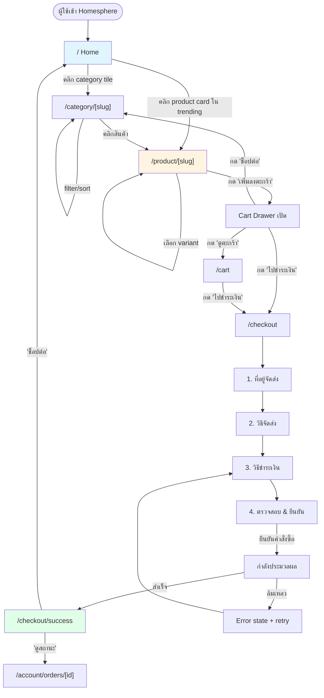
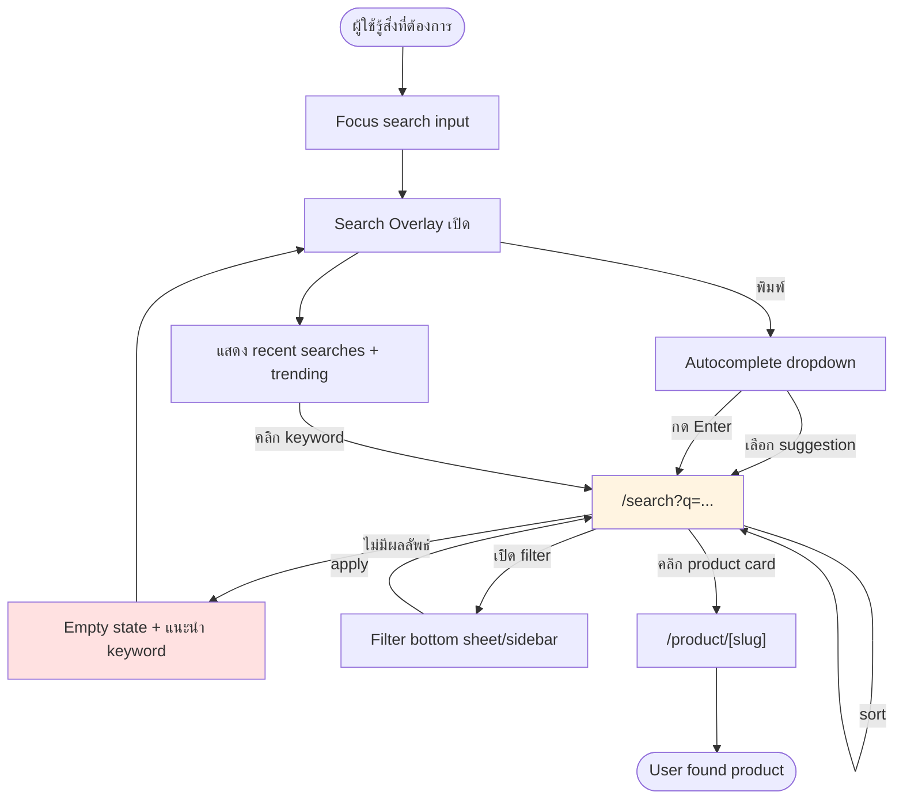
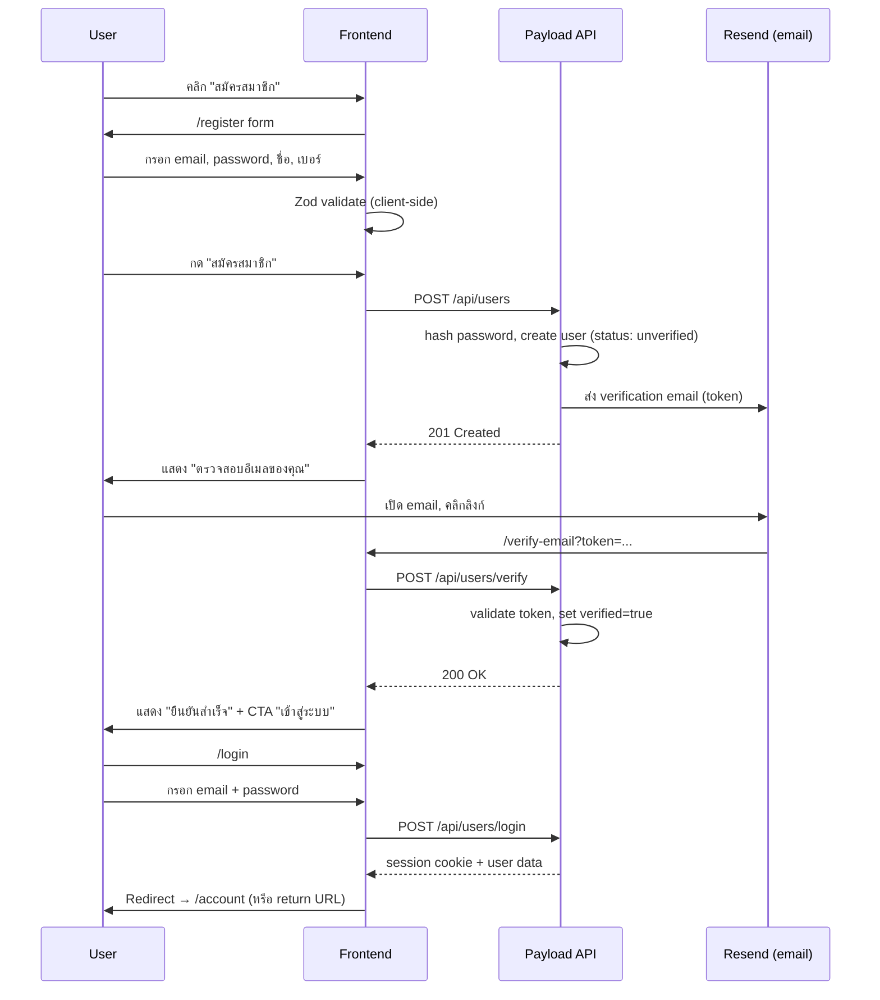
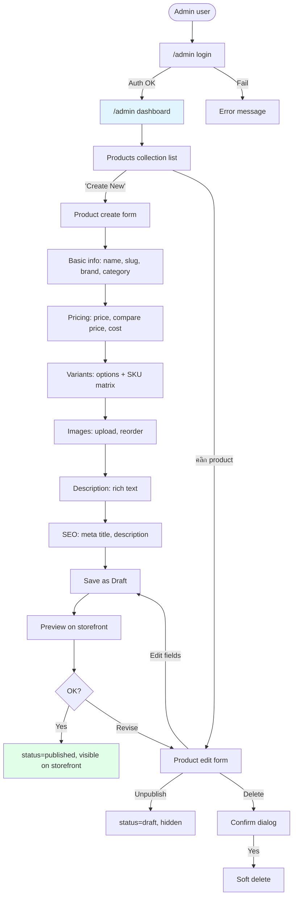
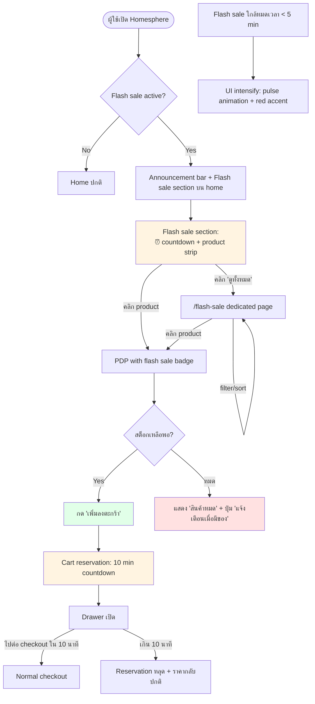

# 02 — User Flows & Wireframe Annotations

> **Owner**: `ux-architect`
> **Project**: Homesphere — E-commerce demo
> **Scope**: Phase 1A — User flows (6 ตาม CHECKLIST) + per-page wireframe intent

แต่ละ flow ประกอบด้วย: diagram (mermaid), entry point, happy path, alternate paths, exit/success criteria, UX considerations — ตามด้วย wireframe annotations ของหน้าสำคัญในส่วนท้าย

---

## Flow 1 — Browse → Category → PDP → Add to Cart → Checkout → Confirm

**ความสำคัญ**: Happy path หลัก — golden flow ของการซื้อสินค้า



### Entry point
- Organic — SEO landing ที่ home / category
- Direct — คลิก URL จาก social / email promo
- Paid — ads link ตรงไป category หรือ PDP

### Happy path
1. Home → scroll เห็น "หมวดยอดนิยม" → tap "เฟอร์นิเจอร์"
2. Category page → filter "โซฟา 3 ที่นั่ง" + sort "ราคาต่ำ-สูง" → คลิก card
3. PDP → เลือก variant (สี/ขนาด) → กด "เพิ่มลงตะกร้า" → Cart drawer เด้งขึ้น
4. กด "ไปชำระเงิน" → Checkout step 1
5. กรอกที่อยู่ → เลือก shipping (ส่งถึงบ้าน / รับที่สาขา) → เลือก payment (บัตร/COD/QR/ผ่อน 0%) → review
6. กด "ยืนยันคำสั่งซื้อ" → success page พร้อมเลขออเดอร์
7. รับ email ยืนยัน

### Alternate paths
- **Guest checkout**: ใน step 1 ถามเพิ่ม email เท่านั้น; offer "สร้างบัญชีเลย?" หลังสำเร็จ
- **Not logged in แต่กด 'ไปชำระเงิน'**: แสดง modal "เข้าสู่ระบบ / ดำเนินการต่อแบบไม่ล็อกอิน"
- **Out of stock ขณะ checkout**: แสดง banner เหนือ step 3 "สินค้า X หมดแล้ว" + ปุ่ม "ลบออก"
- **Coupon invalid**: แสดง error ใต้ coupon input, ยังคง flow ต่อได้
- **Payment ล้มเหลว**: กลับไป step 3 พร้อม preserve ข้อมูลอื่น; แสดง error reason

### Exit / success criteria
- ออเดอร์ถูกสร้างใน DB (status = `pending_payment` → `paid`)
- Email ยืนยันถูกส่ง
- Cart ถูกล้าง
- User landing ที่ success page พร้อมเลขออเดอร์

### UX considerations
- **Loading**: skeleton บน category grid (grid placeholder 2-4 col); PDP show "adding..." บนปุ่ม เมื่อ add to cart
- **Validation**: field-level inline (HH:MM error message ใต้ field), disable CTA ถ้า form invalid
- **Optimistic update**: cart drawer อัพเดตทันทีก่อน server confirm; rollback ถ้า fail
- **Empty states**: category ไม่มีสินค้า → illustration + "ยังไม่มีสินค้าในหมวดนี้" + ปุ่มกลับ home
- **Urgency cues**: แสดง stock level ถ้าน้อย ("เหลือเพียง 3 ชิ้น"); countdown ถ้าเป็น flash sale
- **Error recovery**: payment fail → preserve cart, preserve address; คลิก retry ไม่ต้องกรอกใหม่

---

## Flow 2 — Search → Results → Filter → PDP

**ความสำคัญ**: Secondary discovery path; ทดสอบ search UX + filter clarity



### Entry point
- Header search icon (mobile) / search input (desktop)
- Direct URL: `/search?q=...`
- Voice search (optional, out of scope for demo)

### Happy path
1. ผู้ใช้ tap search → overlay → พิมพ์ "โซฟา"
2. เห็น autocomplete: "โซฟา 3 ที่นั่ง", "โซฟาหนัง", "โซฟาเบด"
3. เลือก "โซฟาหนัง" → `/search?q=โซฟาหนัง`
4. หน้าผลลัพธ์: 48 รายการ, เปิด filter "ราคา ≤ 25,000" + "แบรนด์: IKEA"
5. URL อัพเดต: `/search?q=โซฟาหนัง&price=0-25000&brand=ikea`
6. คลิก product → PDP

### Alternate paths
- **No results**: แสดง "ไม่พบสินค้าที่ตรงกับ 'xxx'" + suggested keywords + related categories + "สินค้ามาใหม่"
- **Typo tolerance**: suggest "คุณหมายถึง 'โซฟา' หรือไม่?" ถ้า query คล้ายคำที่มี result
- **Filter ทำให้ว่าง**: "ไม่มีสินค้าที่ตรง filter ทั้งหมด" + ปุ่ม "ล้างตัวกรอง"
- **URL sharing**: URL พร้อม filter params → load กลับมาได้ถูกต้อง

### Exit / success criteria
- ผู้ใช้ลงที่ PDP → track search keyword ที่ convert
- หรือ navigate ไป category ที่ใกล้เคียง

### UX considerations
- **Debounce autocomplete**: 200–300ms เพื่อลด request
- **Highlight matching keyword** ใน suggestion และใน product title
- **Filter state in URL**: shareable, back button works, browser refresh preserves state
- **Filter badges**: แสดง active filters เป็น chips ด้านบน grid, คลิก X ลบ filter นั้น
- **Count per filter option**: แสดงจำนวนสินค้าใต้ checkbox (เช่น "IKEA (12)")
- **Mobile filter**: bottom sheet เต็มจอ พร้อม "ล้าง" + "ดู X ผลลัพธ์" ที่ปุ่มล่าง
- **Loading**: skeleton 8 cards ขณะ fetch; spinner บน filter panel เมื่อ apply

---

## Flow 3 — Guest → Register → Verify Email → Login

**ความสำคัญ**: ทดสอบ onboarding UX; สำคัญสำหรับ conversion ระยะยาว



### Entry point
- Header "สมัครสมาชิก" link
- Checkout step ("สร้างบัญชีหลังชำระเงิน?")
- CTA ใน marketing email

### Happy path
1. Register form → กรอกครบ → submit
2. เห็นหน้า "ตรวจสอบอีเมลของคุณ" พร้อม illustration + ปุ่ม "ส่งอีเมลอีกครั้ง"
3. เปิด email → คลิกลิงก์ → `/verify-email?token=...`
4. เห็น success → คลิก "เข้าสู่ระบบ"
5. Login form → กรอก → เข้า `/account`

### Alternate paths
- **Email ซ้ำ**: "อีเมลนี้ถูกใช้งานแล้ว, [เข้าสู่ระบบ] หรือ [ลืมรหัสผ่าน]"
- **Password อ่อน**: แสดง strength meter + requirements (min 8, 1 number, 1 special)
- **Verification expired**: "ลิงก์หมดอายุ" + ปุ่ม "ส่งลิงก์ใหม่"
- **ไม่ได้รับ email**: ปุ่ม "ส่งอีกครั้ง" (rate limit 60 sec)
- **Social login (optional)**: Google/Facebook → skip verification ถ้า provider verified

### Exit / success criteria
- User verified = true ใน DB
- Session สร้างสำเร็จ
- Landing ที่ `/account` หรือ return URL

### UX considerations
- **Progressive disclosure**: ไม่ถามข้อมูลเกินจำเป็นตอนสมัคร (address + DOB ขอตอน checkout/profile edit)
- **Password visibility toggle**: icon eye บน password field
- **Real-time validation**: email format check ขณะพิมพ์; password strength bar
- **Accessibility**: label ทุก field, error messages announce by screen reader (aria-live)
- **Trust signals**: PDPA consent checkbox + ลิงก์ privacy policy ใกล้ปุ่ม submit
- **Post-register onboarding** (optional): tooltip tour สั้นๆ บน `/account` first visit

---

## Flow 4 — Login → Account → Order History → Order Detail

**ความสำคัญ**: Post-purchase engagement; ทดสอบ account IA

```mermaid
flowchart TD
    Start([Logged out user]) --> Login["/login"]
    Login --> |submit| Auth{Auth success?}
    Auth --> |Yes| Dash["/account dashboard"]
    Auth --> |No| LoginError[Error: "อีเมลหรือรหัสผ่านไม่ถูกต้อง"]
    LoginError --> Login
    Dash --> |คลิก 'ประวัติการสั่งซื้อ'| Orders["/account/orders"]
    Orders --> |filter by status| Orders
    Orders --> |คลิกออเดอร์| OrderDetail["/account/orders/[id]"]
    OrderDetail --> |'ติดตามสถานะ'| Tracking[Tracking timeline view]
    OrderDetail --> |'สั่งซ้ำ'| ReorderConfirm[Confirm dialog]
    ReorderConfirm --> |ยืนยัน| Cart["/cart (prefilled)"]
    OrderDetail --> |'ยกเลิกคำสั่งซื้อ'| CancelConfirm[Confirm dialog]
    CancelConfirm --> |ยืนยัน| CancelAPI[API cancel]
    CancelAPI --> OrderDetail
    OrderDetail --> |'ขอคืนเงิน'| RefundForm[Refund request form]

    style Dash fill:#e1f5ff
    style OrderDetail fill:#fff4e1
```

### Entry point
- Header "เข้าสู่ระบบ"
- Auth gate ที่ `/account/*`
- Email link (order confirmation → "ดูรายละเอียด")

### Happy path
1. `/login` → กรอก credentials → สำเร็จ
2. `/account` dashboard → เห็น greeting + recent orders card (3 ล่าสุด) + loyalty points + shortcuts
3. คลิก "ดูออเดอร์ทั้งหมด" → `/account/orders`
4. List ออเดอร์ → filter "กำลังจัดส่ง" → คลิกออเดอร์
5. `/account/orders/[id]` → เห็น timeline (paid → packed → shipped → delivered), items, shipping address, payment method, total
6. คลิก "ติดตามสถานะ" → modal พร้อม tracking number + carrier link

### Alternate paths
- **ออเดอร์ยังไม่มี**: empty state illustration + ปุ่ม "เริ่มช็อป"
- **ออเดอร์ถูกยกเลิก**: status badge "ยกเลิก" สีเทา + เหตุผล + ปุ่ม "สั่งซ้ำ"
- **สั่งซ้ำ**: สินค้าบางชิ้นหมด → modal แจ้งและให้เลือก "ข้ามสินค้าที่หมด" หรือ "ยกเลิก"
- **ขอคืนเงิน**: แบบฟอร์มเหตุผล + upload รูป → submit → status เปลี่ยนเป็น "กำลังพิจารณา"

### Exit / success criteria
- ผู้ใช้เข้าถึงข้อมูลออเดอร์ได้ครบ
- Action (reorder/cancel/refund) ดำเนินการสำเร็จ มี feedback ชัดเจน

### UX considerations
- **Order status colors**: pending=gray, paid=blue, shipped=orange, delivered=green, cancelled=red
- **Timeline visual**: vertical stepper with timestamps
- **Responsive layout**: sidebar account nav collapses เป็น tab bar บนมือถือ
- **Quick actions**: prominent buttons สำหรับ primary action per status (paid → "ดู receipt"; shipped → "ติดตาม"; delivered → "รีวิว" + "สั่งซ้ำ")
- **Pagination**: 10 orders ต่อหน้า; load more button บนมือถือแทน page numbers
- **Session expiry**: ถ้า session หมดอายุ → auto redirect login with return URL

---

## Flow 5 — Admin Login → Product CRUD → Publish

**ความสำคัญ**: ทดสอบ admin UX (Payload-native + custom tweaks)



### Entry point
- `/admin` — Payload default login

### Happy path
1. Admin login → dashboard เห็น widget (ยอดขายวันนี้, ออเดอร์ใหม่, สินค้าหมด)
2. Click "Products" → collection list view
3. Click "Create New" → form
4. กรอก basic info: ชื่อ, slug (auto-generate จากชื่อ), brand dropdown, category tree picker
5. Pricing: ราคาขาย, ราคาเปรียบเทียบ (optional)
6. Variants: option types (สี, ขนาด) → generate SKU matrix อัตโนมัติ → set price/stock ต่อ variant
7. Upload images: drag-drop, reorder, set primary
8. Description: rich text editor
9. SEO: meta fields (auto-fill จากชื่อสินค้าได้)
10. Save as draft → preview link → check on storefront → กลับมากด "Publish"
11. สินค้าปรากฏบน storefront

### Alternate paths
- **Validation errors**: แสดง error summary ด้านบน form + inline per field
- **Duplicate SKU**: reject save, show "SKU นี้ถูกใช้งานแล้ว"
- **Image upload fail**: retry button, ไม่ block form save
- **Bulk actions** (list view): เลือกหลายชิ้น → publish/unpublish/delete batch
- **Unpublish** = hide from storefront แต่ไม่ลบ (draft state)
- **Delete** = soft delete (preserve order history integrity)

### Exit / success criteria
- Product status = `published` ใน DB
- ปรากฏบน `/category/[slug]` และ `/product/[slug]` ทันที (revalidate cache)
- Admin เห็น toast "เผยแพร่สินค้าสำเร็จ"

### UX considerations
- **Auto-save draft**: save silently ทุก 30 sec (ลด data loss)
- **Unsaved changes warning**: ถ้า navigate away → confirm dialog
- **Slug uniqueness check**: real-time validation ใต้ field
- **Variant matrix UX**: generate table จาก option combinations; allow delete row (ถ้าไม่ขาย combination นั้น)
- **Image optimization hint**: warn ถ้า upload > 2MB
- **Preview before publish**: สำคัญมาก — admin ต้องเห็น final render ก่อน commit
- **Access control**: role-based (staff เห็น products/orders; admin เห็นทุกอย่าง)

---

## Flow 6 — Flash Sale Countdown → Add to Cart (Urgency UX)

**ความสำคัญ**: Conversion driver; โชว์ความสามารถ real-time UX



### Entry point
- Home → Flash sale section (prominent ด้านบน)
- Announcement bar "⚡ แฟลชเซลเหลือ HH:MM:SS"
- Push notification / email (optional)
- Direct URL `/flash-sale`

### Happy path
1. Home → เห็น announcement bar countdown + flash sale section
2. Scroll เห็น 4-6 flash sale products เป็น horizontal scroll strip
3. แต่ละ card แสดง: % discount, ราคาขีดฆ่า, ราคาใหม่, progress bar "ขายแล้ว 73%"
4. คลิกสินค้า → PDP พร้อม flash sale badge + countdown sticky ที่ด้านบน
5. กด "เพิ่มลงตะกร้า" → drawer เปิดพร้อม "จอง 10:00 นาที" countdown
6. ไป checkout ใน reserved window → ซื้อในราคาพิเศษ

### Alternate paths
- **สินค้าหมด**: ปุ่มเปลี่ยนเป็น "แจ้งเตือนเมื่อมีของ" (collect email)
- **Reservation หมดเวลา**: toast "การจอง 10 นาทีหมดเวลา, ราคาอาจเปลี่ยน" → cart item อัพเดตราคาปกติ หรือแจ้งให้ remove
- **Flash sale จบระหว่างอยู่ใน cart**: แสดง banner "ราคาพิเศษจบแล้ว, ราคาปัจจุบันคือ ฿XXX" + "ยืนยัน" / "ลบออก"
- **Stock ลดเร็วมาก**: real-time polling (ทุก 30 sec) หรือ WebSocket อัพเดต progress bar
- **Limit per user**: "ซื้อได้สูงสุด 2 ชิ้นต่อคำสั่งซื้อ" — disable quantity stepper เกิน limit

### Exit / success criteria
- Order completed ด้วยราคา flash sale
- หรือ user ออกโดย cart ไม่ checkout (track abandonment)

### UX considerations
- **Countdown clarity**: format HH:MM:SS, update ทุกวินาที (client-side)
- **Time sync**: ใช้ server time เป็น source of truth (ลด cheat client clock)
- **Urgency intensity**:
  - > 1 hour: normal color
  - < 1 hour: orange
  - < 10 min: red + pulse animation
  - < 1 min: red bold + pulse fast
- **Stock urgency**: progress bar + "ขายแล้ว X ชิ้น" + "เหลือ Y ชิ้น" (if low)
- **Reservation UI**: แสดง timer ชัดเจนใน cart drawer และ cart page; auto-release + toast
- **Accessibility**: `aria-live="polite"` สำหรับ countdown updates; avoid pure flash/pulse without option
- **Performance**: countdown ใช้ `requestAnimationFrame` หรือ `setInterval(1000)`; ระวัง memory leak (cleanup)
- **Ethical UX**: ไม่ fake countdown, ไม่ fake stock — Best Solution brand = honest
- **Persistent timer**: ถ้า refresh หน้า countdown ยังตรง (compute from `endsAt` timestamp)

---

# Wireframe Annotations — Layout Intent Per Page

> **จุดประสงค์**: บอก layout skeleton ของแต่ละหน้า (section order, prominence hierarchy) — ไม่ใช่ visual design
> Delegate สี/typography/spacing → `design-system-lead`

---

## Home (`/`)

Sections (top → bottom, priority order) — ordering authoritative ตาม `01-sitemap.md` §3.4:

1. **Announcement bar** (dismissable): free shipping / flash sale teaser
2. **Header** (3-row desktop, sticky on scroll)
3. **Hero carousel**: 3-5 slides, 16:9 ratio, auto-advance 5s, pause on hover; CTA button per slide; dot indicators + arrow controls
4. **Quick category tiles**: row ของ 6-8 หมวดหลักพร้อม icon + label (horizontal scroll บนมือถือ)
5. **Flash sale section** (conditional — render ถ้ามี active sale): red-accent background, countdown, horizontal product strip 4-6 ชิ้น + "ดูทั้งหมด →"
6. **Promo strips row**: 3 promo cards (installment 0%, free delivery, free installation)
7. **Trending products**: section header + grid 4-col (desktop) / 2-col (mobile), 8 items
8. **🆕 Shop by Room**: visual tiles — ห้องนอน / ห้องรับแขก / ห้องครัว / ห้องน้ำ / ห้องทำงาน / สวน
   - Layout: 3-col desktop (large tiles 1:1 aspect) / 2-col mobile
   - Each tile: background photo (room ambient) + overlay text "ห้องนอน" + arrow icon
   - Click → `/search?room=bedroom` หรือ category pre-filtered
   - Hover state (desktop): scale 1.02 + darken overlay
   - Section header: "เลือกซื้อตามห้อง" + subtitle "ตกแต่งทุกมุมของบ้านคุณ"
9. **🆕 Shop by Style**: visual tiles ต่อสไตล์การตกแต่ง
   - Styles: Modern / Minimal / Scandinavian / Loft / Thai Contemporary / Luxury (6 tiles)
   - Layout: 3-col desktop (tiles 4:3) / horizontal scroll 2-col mobile
   - Each tile: curated room photo + style name + "ดูแรงบันดาลใจ →"
   - Click → `/search?style=modern` หรือ editorial landing (static page)
   - Section header: "ค้นหาสไตล์ที่ใช่" + short description
10. **Top brands**: logo grid 6-col desktop / 3-col mobile
11. **New arrivals**: grid เหมือน trending, 8 items
12. **Editorial / Inspiration banner** (optional): 2-column split — ภาพ + headline + CTA
13. **Newsletter CTA**: inline form in final section
14. **Footer**

### Shop by Room vs Shop by Style — IA rationale

- **Shop by Room** = ลูกค้ารู้ว่าต้องการของสำหรับห้องไหน → channel เข้า **category** ที่เกี่ยวข้อง (utility-driven)
- **Shop by Style** = ลูกค้ามี aesthetic preference → channel เข้า **curated collection** ข้ามหมวด (inspiration-driven)
- สองทางเลือกนี้ไม่ซ้ำซ้อน — ตอบ user intent คนละแบบ

### Data requirements (→ data-architect)

- `Product` ต้องมี `styleTags[]` (modern/minimal/...) + `roomTags[]` (bedroom/living/...) หรือ separate taxonomy
- หรือใช้ Payload `Collection` entity แยก (Collections: "โมเดิร์น", "ห้องนอนที่พัก")
- Seed data ต้องกระจาย tags ให้ filter ทำงานได้

---

## Category Listing (`/category/[slug]`)

Layout: 2-column desktop (sidebar filter + main grid), single column mobile

- **Breadcrumb**: หน้าหลัก > [parent] > [current]
- **Category header**: title + item count + subcategory pills (horizontal scroll)
- **Hero banner** (optional): category-specific promo
- **Controls row**: sort dropdown (left) + view toggle (grid/list) + "ตัวกรอง" button (mobile only, opens bottom sheet)
- **Left sidebar** (desktop): filter panel — expandable sections
  - ราคา (range slider)
  - แบรนด์ (checkbox list + search)
  - คะแนนรีวิว (radio: 4★+, 3★+, ทั้งหมด)
  - Attribute-specific (สี, วัสดุ, ขนาด)
  - "ล้างตัวกรองทั้งหมด" link
- **Main grid**: product cards 4-col (desktop) → 2-col (mobile)
  - Card: image (square), name (2-line clamp), price (+ compare price), rating stars, quick-add button on hover
  - Flash sale badge top-left; % discount badge top-right
- **Active filter chips** row (above grid): removable tags
- **Pagination**: page numbers (desktop), "โหลดเพิ่ม" (mobile)
- **Empty state**: illustration + "ไม่มีสินค้าในตัวกรองนี้" + "ล้างตัวกรอง"

---

## Product Detail (`/product/[slug]`)

Layout: 2-column desktop (gallery + info), single column mobile with sticky CTA

- **Breadcrumb**
- **Left column (desktop)**: image gallery
  - Main image (square, zoomable)
  - Thumbnail strip below (5-8 thumbnails)
  - Mobile: swipeable carousel with dots
- **Right column (desktop)**: product info
  - Product title
  - Brand link (→ brand page)
  - Rating summary (stars + review count link)
  - Price block: compare price (strikethrough) + current + savings %
  - Flash sale countdown (if active)
  - Variant selector: chips for color/size
  - Quantity stepper
  - Stock indicator: "พร้อมส่ง" / "เหลือ 3 ชิ้น" / "สินค้าหมด"
  - **Primary CTA**: "เพิ่มลงตะกร้า" (full-width button)
  - **Secondary CTA**: "ซื้อทันที" (skip cart → checkout)
  - "เพิ่มในรายการถูกใจ" icon button
  - Promo strip: ผ่อน 0%, ส่งฟรี, รับประกัน badges
  - Store pickup option: "รับที่สาขา" expandable section
- **Sticky add-to-cart bar** (mobile only, appears on scroll past CTA): compact price + "เพิ่มลงตะกร้า"
- **Tabs section** (below fold):
  - รายละเอียดสินค้า (description, rich text)
  - ข้อมูลจำเพาะ (spec table)
  - รีวิว (+ filters by rating)
  - คำถาม-คำตอบ (optional)
- **Related products**: horizontal scroll strip, 6-8 items
- **Recently viewed**: bottom section (localStorage-driven)

---

## Cart (`/cart`)

Layout: 2-column desktop (items + summary), stacked mobile with sticky summary

- **Breadcrumb / page title**: "ตะกร้าสินค้า (X รายการ)"
- **Left column**: cart item list
  - Each item: thumbnail, name, variant info, price, quantity stepper, remove button
  - Availability warning (ถ้า stock ไม่พอ)
  - Flash sale reservation timer (if applicable)
- **Right column**: summary card (sticky on scroll)
  - Subtotal
  - Coupon input + "ใช้" button
  - Applied coupon chip (removable)
  - Shipping (estimated or "คำนวณในขั้นถัดไป")
  - Total (bold, large)
  - Primary CTA: "ไปชำระเงิน"
  - Secondary link: "ช็อปต่อ"
  - Payment badges row (trust signals)
- **Empty state**: illustration + "ตะกร้าของคุณยังว่าง" + "เริ่มช็อป" button
- **Recommendations**: "คุณอาจสนใจ" horizontal scroll (below cart list)
- **Mobile sticky footer**: total + "ไปชำระเงิน" button

---

## Checkout (`/checkout`)

Layout: 2-column desktop (form + summary), single column mobile with collapsible summary

- **Simplified header**: logo only + "ชำระเงินปลอดภัย 🔒" + "กลับไปยังตะกร้า" link (ลบ mega menu — ลด distraction)
- **Step indicator**: 1. ที่อยู่ · 2. จัดส่ง · 3. ชำระเงิน · 4. ตรวจสอบ (progress bar)
- **Left column**: active step form
  - **Step 1 — Address**:
    - Toggle: "ใช้ที่อยู่ที่บันทึก" / "เพิ่มที่อยู่ใหม่"
    - ชื่อ, เบอร์, ที่อยู่ (จังหวัด/อำเภอ/ตำบล cascade dropdown), รหัสไปรษณีย์
    - Checkbox: "บันทึกที่อยู่นี้" (logged in only)
    - Guest: email field เพิ่ม
  - **Step 2 — Shipping**:
    - Radio: ส่งถึงบ้าน (฿xx, x-y วัน) / รับที่สาขา (ฟรี) / นัดจัดส่งพิเศษ
    - ถ้า "รับที่สาขา" → store selector
  - **Step 3 — Payment**:
    - Payment method radios:
      - บัตรเครดิต/เดบิต (Stripe test)
      - พร้อมเพย์ / QR
      - เก็บเงินปลายทาง (COD)
      - ผ่อน 0% (ระบุบัตรรองรับ + งวด)
      - TrueMoney Wallet
    - Card form (ถ้าเลือกบัตร): card number, exp, CVC, name
  - **Step 4 — Review**:
    - สรุปทั้งหมด: address, shipping, payment, items
    - Terms checkbox: "ฉันยอมรับข้อกำหนด..."
    - CTA: "ยืนยันคำสั่งซื้อ" (ใหญ่, full-width)
- **Right column**: order summary (sticky)
  - Item list (compact — thumbnail + name + qty + price)
  - Subtotal / shipping / discount / total
  - Coupon input (collapsible)
  - Trust badges: ssl, refund policy, customer support
- **Mobile**: summary เป็น collapsible "ดูรายละเอียด (X รายการ ฿XX)" ที่ด้านบน

---

## Search Results (`/search`)

Same layout as category listing, เพิ่ม:
- Search header: "ผลลัพธ์สำหรับ 'keyword' (X รายการ)"
- "ไม่พบผลลัพธ์?" link → contact / suggest keyword
- No results state: illustration + suggested keywords + trending categories

---

## Account Dashboard (`/account`)

Layout: 2-column desktop (sidebar nav + main), stacked mobile with top tab bar

- **Account header**: greeting "สวัสดี, คุณ___" + avatar + membership tier badge
- **Left sidebar nav** (desktop):
  - แดชบอร์ด (active)
  - คำสั่งซื้อของฉัน
  - ที่อยู่จัดส่ง
  - รายการถูกใจ
  - คูปองของฉัน
  - Homesphere Card (loyalty)
  - ข้อมูลส่วนตัว
  - ออกจากระบบ
- **Main content**:
  - Stat cards row (3 cards): Loyalty points · Active orders · Saved items
  - Recent orders section (last 3): compact cards + "ดูทั้งหมด"
  - Recently viewed products strip
  - Recommended for you strip
  - Promo banner (personalized, optional)

---

## Order Detail (`/account/orders/[id]`)

- **Breadcrumb**: บัญชีของฉัน > คำสั่งซื้อ > #OrderNo
- **Header row**: Order #, date, status badge, primary action button ("ติดตามสถานะ" / "รีวิว")
- **Status timeline**: vertical stepper (paid → packed → shipped → delivered) with timestamps
- **Items section**: list ของสินค้า (thumb + name + qty + price + "สั่งซ้ำ" per item)
- **Shipping address card**
- **Payment method card**
- **Order summary**: subtotal / shipping / discount / total
- **Action buttons row**: ติดตาม / ยกเลิก (ถ้ายังไม่จัดส่ง) / ขอคืนเงิน (ถ้าส่งแล้ว) / สั่งซ้ำทั้งหมด
- **Contact support** link at bottom

---

## Admin Product Form (`/admin/collections/products/create|edit`)

(Payload default + minor customization)

- Top bar: breadcrumb + Save / Publish / Preview / Delete buttons
- Tabs: Basic / Pricing / Variants / Images / Description / SEO
- Right sidebar: status (draft/published), last saved, revisions, quick links
- Bottom: save indicator + unsaved changes warning

---

## Flash Sale Page (`/flash-sale`)

- **Hero section**: large countdown timer (HH:MM:SS) + campaign title + description
- **Filter bar**: category filter (chips) + sort (% discount / ending soon / popularity)
- **Product grid**: 4-col desktop / 2-col mobile
  - Each card: large % discount badge, before/after price, progress bar (% sold), mini countdown if item-specific
- **Empty state** (if sale ended): "แฟลชเซลจบแล้ว" + countdown to next sale + CTA "ดูโปรโมชั่นอื่น"

---

## Store Locator (`/stores`)

Layout: map + list (split 50/50 desktop, toggle tabs on mobile)

- **Search bar**: "ค้นหาสาขาใกล้คุณ" (geo + text)
- **Filter chips**: จังหวัด / บริการพิเศษ (installation, repair)
- **Map**: embedded map with store pins (clickable → highlight card)
- **List**: store cards (name, address, hours, distance, phone, "ดูรายละเอียด")
- **Mobile**: tab toggle "แผนที่" / "รายการ"

---

## 404 / Error

- Centered layout
- Illustration + heading ("ไม่พบหน้าที่คุณต้องการ" / "เกิดข้อผิดพลาด")
- Support text
- Primary CTA: "กลับหน้าหลัก"
- Secondary: search box

---

## Cross-page UX Patterns

- **Loading**: skeleton screens (not spinners) สำหรับ content lists; spinner เฉพาะ inline actions
- **Toast notifications**: bottom-right desktop / top mobile, auto-dismiss 4 sec
- **Modal confirmations**: สำหรับ destructive actions (cancel order, delete address, remove coupon)
- **Form validation**: inline per field + summary at top if multiple errors
- **Keyboard navigation**: all interactive elements reachable via Tab; Esc closes modals/drawers
- **Focus management**: trap focus in modals; return focus to trigger on close

---

## Handoff Notes

- **→ design-system-lead**: components ที่ flows ใช้และต้องมีใน inventory: `StepIndicator`, `StatusTimeline`, `CountdownTimer`, `ProgressBar` (stock %), `QuantityStepper`, `VariantSelector`, `CouponInput`, `AddressForm`, `PaymentMethodSelector`, `EmptyState`, `Skeleton`, `Toast`, `ConfirmDialog`, `Breadcrumb`, `LanguageToggle`, `RoomStyleTile` (visual tile สำหรับ Shop by Room/Style — photo background + overlay label)
- **→ data-architect**: flows ต้องการ entity/field:
  - `Cart` ต้องมี `reservedUntil` field (สำหรับ flash sale reservation)
  - `Order` ต้องมี `statusHistory` (timeline) + `trackingNumber`
  - `Product` ต้องมี `stockLevel` + `flashSale` sub-entity (startsAt, endsAt, discountPct, limitPerUser) + `roomTags[]` + `styleTags[]`
  - `Coupon` ต้องมี validation rules (minSubtotal, allowedCategories)
  - `Review` ต้องมี order-gated logic (รีวิวได้เฉพาะ delivered orders)
  - **Localization**: bilingual fields (`name_th/en`, `description_th/en`) หรือใช้ Payload localization plugin (รองรับ TH/EN ตาม approved scope)
  - **Taxonomy**: Room taxonomy (bedroom, living, kitchen, bathroom, office, garden) + Style taxonomy (modern, minimal, scandinavian, loft, thai-contemporary, luxury) — ใช้สำหรับ Shop by Room/Style sections
- **→ team-lead**: Phase 1A decisions approved 2026-04-16 — ดู `01-sitemap.md` §9 Resolved Decisions table

---

**Last updated**: 2026-04-16
**Status**: Approved — revision 2
**Revisions**:
- v1 (2026-04-16): Initial draft
- v2 (2026-04-16): Team-lead approval — expanded Shop by Room → Shop by Room + Shop by Style wireframe + data requirements
