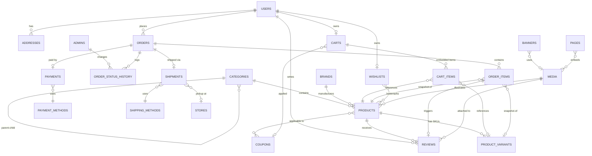
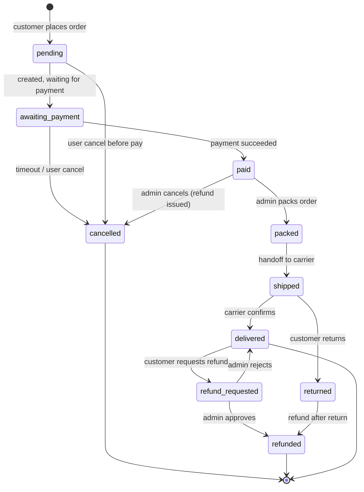

# 05 — Content / Data Model

> **Owner**: `data-architect` (Homesphere-Prep team)
> **Scope**: Phase 1C ของ `CHECKLIST.md` — entity list เต็ม, fields, relationships, ER diagram, state machines, seed plan
> **Tech**: Payload CMS 3 (TypeScript-native) + PostgreSQL (prod) / SQLite (local)
> **Audience**: Phase 4 `fullstack-admin` (implement collections), Phase 5 `fullstack-storefront` (consume data), Phase 2 designer (ยืนยัน field ให้ครบกับ UI)

---

## 0. หลักการและขอบเขต

### หลักการออกแบบ
1. **Demo-friendly** — ไม่รองรับ multi-vendor, multi-currency, tax ซับซ้อน, loyalty point calculation
2. **Payload-native** — ใช้ field type ที่ Payload มีในตัว (text, number, relationship, array, blocks, upload, richText, select, checkbox, date, group) ไม่ต้องเขียน hook พิเศษเว้นแต่จำเป็น
3. **Realistic enough** — field set ต้องครอบคลุมสิ่งที่ HomePro / JIB / Lazada ใช้จริง เพื่อให้ลูกค้าเชื่อ
4. **Sensible defaults** — กำหนด default / required ชัดเจน; ลดโอกาส null data
5. **Single source of truth** — `Products` มี base info, `ProductVariants` เก็บ SKU ต่อ variant จริง (price/stock แยก)

### Monetary / Locale
- **Currency**: THB เท่านั้น — เก็บเป็น `number` (หน่วยสตางค์ = integer ปลอดภัยกว่า, แต่เพื่อความง่ายในงาน demo ใช้ `number` หน่วยบาท รองรับ 2 ตำแหน่งทศนิยมผ่าน `min: 0, admin.step: 0.01`)
- **Locale**: ภาษาไทยเป็นหลัก, EN optional (Payload localization `tr/en`)
- **Timezone**: `Asia/Bangkok` — timestamp เก็บ UTC, แสดงใน admin แบบ local

### Naming convention
- Collection slug: `snake_case` พหูพจน์ (`products`, `order_items`)
- Field name: `camelCase` (`basePrice`, `stockQty`)
- Enum value: `kebab-case` หรือ `snake_case` lower (`pending`, `out_for_delivery`)

---

## 1. Entity Inventory (รายการ collection ทั้งหมด)

| # | Collection slug | Purpose | หมวด |
|---|---|---|---|
| 1 | `media` | Upload collection สำหรับรูปภาพ/ไฟล์ทั้งระบบ | Infra |
| 2 | `categories` | หมวดสินค้าแบบ tree (parent-child) | Catalog |
| 3 | `brands` | แบรนด์สินค้า | Catalog |
| 4 | `products` | สินค้า base (ชื่อ, description, specs, รูป) | Catalog |
| 5 | `product_variants` | SKU จริง (สี × ขนาด × ฯลฯ) พร้อม price + stock | Catalog |
| 6 | `users` | ลูกค้า (customer) — Payload auth collection | Account |
| 7 | `admins` | Admin / Staff — Payload auth collection แยก | Account |
| 8 | `addresses` | ที่อยู่ลูกค้า (shipping + billing) | Account |
| 9 | `carts` | ตะกร้าสินค้า (หนึ่งใบต่อ user หรือ guest session) | Commerce |
| 10 | `cart_items` | รายการในตะกร้า (embedded ก็ได้ แต่แยก collection เพื่อ query ง่าย) | Commerce |
| 11 | `orders` | ออเดอร์หลัก (snapshot ราคา + ที่อยู่ + ยอดรวม) | Commerce |
| 12 | `order_items` | รายการสินค้าในออเดอร์ (snapshot variant + price ณ เวลาสั่ง) | Commerce |
| 13 | `order_status_history` | log การเปลี่ยน status ของ order | Commerce |
| 14 | `payments` | ข้อมูลการชำระเงิน (Stripe intent, slip upload, COD) | Commerce |
| 15 | `payment_methods` | catalog วิธีชำระเงินที่เปิดใช้ (Credit card, PromptPay, COD) | Config |
| 16 | `shipments` | ข้อมูลการจัดส่ง (tracking, carrier, shipped date) | Commerce |
| 17 | `shipping_methods` | catalog วิธีจัดส่งที่เปิดใช้ (Standard, Express, Store pickup) | Config |
| 18 | `reviews` | รีวิวสินค้า (rating + comment + images) | Engagement |
| 19 | `wishlists` | wishlist ต่อ user (array ของ product refs) | Engagement |
| 20 | `coupons` | คูปอง/โปรโมชั่น (code, discount, conditions) | Marketing |
| 21 | `banners` | hero slide + promo strip | Marketing/CMS |
| 22 | `pages` | CMS static pages (about, contact, policy) ด้วย block-based | CMS |
| 23 | `stores` | สาขา/หน้าร้าน สำหรับ store locator | CMS |
| 24 | `settings` (global) | Site settings (logo, contact, social) — Payload **Global** ไม่ใช่ collection | Config |

> **หมายเหตุ**: `carts` + `cart_items` สามารถรวมเป็น embedded array ใน `carts` ได้ตาม Payload pattern — ดู decision ใน §14

---

## 2. Entity Specs (รายละเอียด fields ทุก collection)

> รูปแบบ: ตาราง field name · type (Payload) · required · default · notes
> ย่อคำว่า `rel:` = `relationship`, `req` = required

---

### 2.1 `media` (Upload collection)

**Purpose**: เก็บรูปภาพ/ไฟล์ทั้งหมด (สินค้า, banner, avatar, review photos, slip)

**Fields**:
| Field | Type | Req | Default | Notes |
|---|---|---|---|---|
| `filename` | (auto) | - | - | จาก Payload |
| `mimeType` | (auto) | - | - | |
| `filesize` | (auto) | - | - | |
| `alt` | text (localized) | yes | - | alt text สำหรับ a11y (TH req / EN optional — ดู §15) |
| `caption` | text (localized) | no | - | ใช้เป็น figcaption |
| `usage` | select | no | `general` | `product-gallery` / `banner` / `category` / `store` / `room-tile` / `avatar` / `review` / `payment-slip` / `general` |
| `source` | select | yes | `user-upload` | **`unsplash`** / **`fal-generated`** / `user-upload` — track ที่มาของรูป |
| `sourceRef` | text | no | - | external ref: Unsplash photo ID (`photo-abc123`) หรือ fal.ai request ID; null สำหรับ user-upload |
| `sourceUrl` | text | no | - | original source URL (Unsplash page link หรือ fal response URL) — audit + re-download |
| `attribution` | group | no | - | `{photographer: text, photographerUrl: text}` — สำหรับ Unsplash (ไม่ required แต่เก็บเพื่อ ethical practice) |
| `width`, `height` | number | - | - | auto จาก sharp |
| `sizes` | object | - | - | Payload auto resize — `thumbnail` (400), `card` (800), `feature` (1600) |

**Access**:
- `read`: public (ยกเว้น `usage=payment-slip` → admin + owner)
- `create/update/delete`: admin only; customer create ได้เฉพาะ `usage=review` หรือ `avatar` (auto `source=user-upload`)

**Indexes**: `usage`, `source`

---

### 2.2 `categories`

**Purpose**: หมวดสินค้าแบบ tree (Home & Living → เครื่องใช้ไฟฟ้า → พัดลม)

**Fields**:
| Field | Type | Req | Default | Notes |
|---|---|---|---|---|
| `name` | text (localized tr/en) | yes | - | |
| `slug` | text | yes | - | unique, `admin.position: sidebar` |
| `parent` | rel → `categories` | no | null | null = top-level |
| `description` | richText | no | - | |
| `icon` | rel → `media` | no | - | icon เล็ก (SVG/PNG) |
| `coverImage` | rel → `media` | no | - | cover banner ของหมวด |
| `displayOrder` | number | no | 0 | sort order ภายใน sibling |
| `featured` | checkbox | no | false | โชว์บน home |
| `seo.title` | text | no | - | meta title |
| `seo.description` | textarea | no | - | meta description |
| `isActive` | checkbox | no | true | |

**Relationships**:
- self-reference `parent` (tree)
- inverse: `products.category`

**Indexes**: `slug` (unique), `parent`, `featured`

**Access**: read public; write admin

---

### 2.3 `brands`

**Purpose**: แบรนด์สินค้า (Hitachi, Sharp, Mitsubishi, etc.)

**Fields**:
| Field | Type | Req | Default | Notes |
|---|---|---|---|---|
| `name` | text | yes | - | |
| `slug` | text | yes | - | unique |
| `logo` | rel → `media` | no | - | |
| `description` | textarea | no | - | |
| `website` | text | no | - | URL validation |
| `countryOfOrigin` | text | no | - | "Japan", "Thailand" |
| `featured` | checkbox | no | false | โชว์ใน brand grid หน้าแรก |
| `isActive` | checkbox | no | true | |

**Indexes**: `slug` (unique), `featured`

**Access**: read public; write admin

---

### 2.4 `products`

**Purpose**: Product base — ข้อมูลกลางก่อน variant

**Fields**:
| Field | Type | Req | Default | Notes |
|---|---|---|---|---|
| `title` | text (localized) | yes | - | |
| `slug` | text | yes | - | unique |
| `sku` | text | yes | - | base SKU pattern `HS-<CAT>-<BRAND>-<NUM>` |
| `category` | rel → `categories` | yes | - | primary category |
| `additionalCategories` | rel → `categories` (hasMany) | no | [] | cross-listing |
| `brand` | rel → `brands` | yes | - | |
| `shortDescription` | textarea (localized) | no | - | 1-2 บรรทัด สำหรับ card |
| `description` | richText (localized) | yes | - | เต็ม — Payload lexical |
| `specifications` | array | no | [] | spec items (ดูข้างล่าง) |
| `gallery` | array | yes | - | min 1 (ดูข้างล่าง) |
| `basePrice` | number | yes | - | ราคาตั้งต้น (ก่อนลด); variant override ได้ |
| `compareAtPrice` | number | no | null | ราคาก่อนลด (strikethrough) |
| `costPrice` | number | no | null | ต้นทุน (admin only) |
| `hasVariants` | checkbox | no | false | ถ้า true → ต้องมี `variants` ≥ 1 |
| `variantOptions` | array | no | [] | nested: `name` (text), `values` (array text) เช่น `{name:"สี", values:["ขาว","ดำ"]}` |
| `defaultVariant` | rel → `product_variants` | no | null | variant ที่แสดงก่อน |
| `stockQty` | number | conditional | 0 | ใช้เมื่อ `hasVariants=false` |
| `lowStockThreshold` | number | no | 5 | alert เมื่อน้อยกว่า |
| `weightKg` | number | no | - | สำหรับคำนวณค่าส่ง |
| `dimensionsCm` | group | no | - | `{w, h, d}` |
| `tags` | array text | no | [] | `flash-sale`, `new-arrival`, `bestseller` |
| `isFeatured` | checkbox | no | false | โชว์บน home |
| `isFlashSale` | checkbox | no | false | |
| `flashSaleStart`, `flashSaleEnd` | date | no | - | required ถ้า `isFlashSale=true` |
| `flashSalePrice` | number | no | - | ราคาลดใน flash sale |
| `rating.average` | number | - | 0 | auto จาก reviews (hook) |
| `rating.count` | number | - | 0 | auto |
| `salesCount` | number | - | 0 | auto เพิ่มตอน order complete |
| `warrantyMonths` | number | no | 12 | ระยะเวลาประกัน |
| `seo.title` | text | no | - | |
| `seo.description` | textarea | no | - | |
| `seo.ogImage` | rel → `media` | no | - | |
| `status` | select | yes | `draft` | `draft` / `active` / `archived` |
| `publishedAt` | date | no | - | |

**Sub-structures**:

`specifications` array:
| Sub-field | Type |
|---|---|
| `group` | text (e.g. "General", "Electrical") |
| `label` | text ("Power", "Voltage") |
| `value` | text ("800W", "220V") |

`gallery` array:
| Sub-field | Type |
|---|---|
| `image` | rel → `media` (req) |
| `isPrimary` | checkbox |
| `variant` | rel → `product_variants` (optional — ถ้ารูปนี้เฉพาะ variant) |

**Relationships**:
- `category`, `brand` → many-to-one
- `variants` → one-to-many (inverse `product_variants.product`)
- `reviews` → one-to-many

**Indexes**: `slug` (unique), `sku` (unique), `category`, `brand`, `status`, `isFeatured`, `isFlashSale`, `tags`

**Access**:
- `read`: public — แต่ filter `status=active` สำหรับ non-admin
- `create/update/delete`: admin only

---

### 2.5 `product_variants`

**Purpose**: SKU จริงที่ลูกค้าซื้อ (เช่น "พัดลมฮิตาชิ สีขาว 16 นิ้ว")

**Fields**:
| Field | Type | Req | Default | Notes |
|---|---|---|---|---|
| `product` | rel → `products` | yes | - | |
| `sku` | text | yes | - | unique, pattern `HS-<CAT>-<BRAND>-<NUM>-<OPT1>-<OPT2>` |
| `optionValues` | array | yes | - | nested: `{name:"สี", value:"ขาว"}` — match กับ `product.variantOptions` |
| `price` | number | yes | - | override `product.basePrice` |
| `compareAtPrice` | number | no | null | |
| `stockQty` | number | yes | 0 | min: 0 |
| `reservedQty` | number | no | 0 | ของที่อยู่ใน active cart (optional — ใช้ถ้าจะทำ reserve) |
| `barcode` | text | no | - | |
| `image` | rel → `media` | no | - | รูปเฉพาะ variant |
| `weightKg` | number | no | - | override |
| `isActive` | checkbox | no | true | ปิดขาย variant นี้ได้ |

**Relationships**: `product` → many-to-one

**Indexes**: `sku` (unique), `product`, compound `(product, optionValues)` unique

**Access**: read public; write admin

---

### 2.6 `users` (Customer — Payload auth)

**Purpose**: ลูกค้า — `auth: true` collection

**Fields**:
| Field | Type | Req | Default | Notes |
|---|---|---|---|---|
| `email` | (auth) | yes | - | unique จาก Payload |
| `password` | (auth) | yes | - | hashed จาก Payload |
| `firstName` | text | yes | - | |
| `lastName` | text | yes | - | |
| `phone` | text | no | - | TH format validation `0\d{9}` |
| `dateOfBirth` | date | no | - | |
| `gender` | select | no | - | `male`/`female`/`other`/`prefer-not` |
| `avatar` | rel → `media` | no | - | |
| `defaultShippingAddress` | rel → `addresses` | no | - | |
| `defaultBillingAddress` | rel → `addresses` | no | - | |
| `marketingOptIn` | checkbox | no | false | email newsletter |
| `loyaltyTier` | select | no | `bronze` | `bronze`/`silver`/`gold` — cosmetic สำหรับ demo |
| `totalSpent` | number | - | 0 | auto-update จาก orders |
| `orderCount` | number | - | 0 | auto |
| `lastLoginAt` | date | - | - | auto |
| `isActive` | checkbox | no | true | admin ปิด account ได้ |
| `verifiedEmail` | checkbox | - | false | Payload verify flow |

**Access**:
- `read`: own record only (filter `id === user.id`) + admin all
- `update`: own profile (ยกเว้น `loyaltyTier`, `totalSpent`, `isActive` = admin only)
- `create`: public (self-register)
- `delete`: admin only (soft delete ผ่าน `isActive=false`)

**Indexes**: `email` (unique), `phone`

---

### 2.7 `admins` (Admin/Staff — Payload auth แยก collection)

**Purpose**: พนักงาน — แยก collection เพื่อกัน customer จาก admin panel

**Fields**:
| Field | Type | Req | Default | Notes |
|---|---|---|---|---|
| `email` | (auth) | yes | - | unique |
| `password` | (auth) | yes | - | |
| `firstName`, `lastName` | text | yes | - | |
| `role` | select | yes | `staff` | `admin` / `staff` / `support` |
| `permissions` | array select | no | [] | granular (ดู §12 role matrix) |
| `department` | select | no | - | `catalog`/`orders`/`marketing`/`it` |
| `isActive` | checkbox | no | true | |
| `lastLoginAt` | date | - | - | |

**Access**:
- `read/update/delete`: `role=admin` only; `staff` อ่าน own record เท่านั้น
- `create`: `role=admin` only (ห้าม public)

**Indexes**: `email` (unique), `role`

---

### 2.8 `addresses`

**Purpose**: ที่อยู่ลูกค้า (one customer ↔ many addresses)

**Fields**:
| Field | Type | Req | Default | Notes |
|---|---|---|---|---|
| `user` | rel → `users` | yes | - | |
| `label` | text | no | - | "บ้าน", "ที่ทำงาน" |
| `recipientName` | text | yes | - | |
| `recipientPhone` | text | yes | - | |
| `addressLine1` | text | yes | - | บ้านเลขที่, ถนน |
| `addressLine2` | text | no | - | |
| `subDistrict` | text | yes | - | ตำบล/แขวง |
| `district` | text | yes | - | อำเภอ/เขต |
| `province` | text | yes | - | จังหวัด |
| `postalCode` | text | yes | - | 5 หลัก |
| `country` | text | yes | `TH` | default TH |
| `isDefaultShipping` | checkbox | no | false | |
| `isDefaultBilling` | checkbox | no | false | |
| `notes` | textarea | no | - | "ฝากไว้หน้าบ้าน" |

**Relationships**: `user` → many-to-one

**Access**:
- `read/update/delete`: owner + admin
- `create`: authenticated user

**Indexes**: `user`

---

### 2.9 `carts`

**Purpose**: ตะกร้าสินค้า (active shopping session)

**Fields**:
| Field | Type | Req | Default | Notes |
|---|---|---|---|---|
| `user` | rel → `users` | no | null | null = guest cart |
| `sessionToken` | text | conditional | - | required เมื่อ guest |
| `items` | array (embedded) | - | [] | ดู sub-structure |
| `subtotal` | number | - | 0 | auto-calculate (hook) |
| `discountTotal` | number | - | 0 | auto |
| `appliedCoupon` | rel → `coupons` | no | null | |
| `estimatedShipping` | number | - | 0 | rough estimate |
| `estimatedTotal` | number | - | 0 | subtotal - discount + shipping |
| `itemCount` | number | - | 0 | sum qty |
| `status` | select | yes | `active` | `active`/`converted`/`abandoned` |
| `convertedOrder` | rel → `orders` | no | null | set เมื่อ checkout สำเร็จ |
| `lastActivityAt` | date | - | now | abandon sweeper ใช้ |

**`items` sub-structure** (embedded array):
| Sub-field | Type | Notes |
|---|---|---|
| `product` | rel → `products` (req) | |
| `variant` | rel → `product_variants` | req ถ้า product มี variant |
| `quantity` | number (req, min:1) | |
| `priceSnapshot` | number | ราคาตอนหยิบเข้าตะกร้า (อัปเดตเมื่อ refresh) |
| `addedAt` | date | |

**Relationships**: `user` → many-to-one, `appliedCoupon` → many-to-one

**Indexes**: `user`, `sessionToken`, `status`, `lastActivityAt`

**Access**:
- `read/update`: owner (by user OR sessionToken match) + admin
- `create`: public (guest)
- `delete`: owner + admin

> **Design note**: เลือก embedded `items` แทนแยก `cart_items` collection เพราะ (1) cart lifecycle สั้น, (2) ลด join query, (3) Payload `array` field รองรับ relationship ในแต่ละ row ได้ดี — ดู §14 Decisions

---

### 2.10 `orders`

**Purpose**: ออเดอร์ที่ลูกค้าสั่งสำเร็จ (immutable snapshot ของราคา + address)

**Fields**:
| Field | Type | Req | Default | Notes |
|---|---|---|---|---|
| `orderNumber` | text | yes | auto | pattern `HS<YYMMDD>-<6HEX>` เช่น `HS260416-A3F9D1` |
| `user` | rel → `users` | no | null | null = guest checkout |
| `guestEmail` | text | conditional | - | required เมื่อ guest |
| `guestPhone` | text | conditional | - | |
| `items` | rel → `order_items` (hasMany) | yes | - | |
| `shippingAddress` | group (snapshot) | yes | - | copy จาก `addresses` ณ เวลานั้น |
| `billingAddress` | group (snapshot) | yes | - | |
| `subtotal` | number | yes | - | รวมราคาสินค้าก่อนลด |
| `discountTotal` | number | - | 0 | ส่วนลดรวม |
| `appliedCoupon` | group | no | - | snapshot: `{code, discountType, value}` |
| `shippingFee` | number | yes | 0 | |
| `shippingMethod` | rel → `shipping_methods` | yes | - | |
| `tax` | number | - | 0 | demo: 0 หรือ VAT included |
| `total` | number | yes | - | final amount |
| `currency` | text | yes | `THB` | |
| `status` | select | yes | `pending` | ดู §11 state machine |
| `paymentStatus` | select | yes | `unpaid` | `unpaid`/`paid`/`refunded`/`partially-refunded` |
| `fulfillmentStatus` | select | - | `unfulfilled` | `unfulfilled`/`packed`/`shipped`/`delivered` |
| `payment` | rel → `payments` | no | - | |
| `shipment` | rel → `shipments` | no | - | |
| `notes` | textarea | no | - | ลูกค้าเขียนถึงร้าน |
| `internalNotes` | textarea | no | - | admin only |
| `placedAt` | date | yes | now | |
| `paidAt` | date | no | - | |
| `shippedAt` | date | no | - | |
| `deliveredAt` | date | no | - | |
| `cancelledAt` | date | no | - | |
| `cancelReason` | text | no | - | |

**Sub-structures**:

`shippingAddress` / `billingAddress` group (snapshot — field เหมือน `addresses`):
```
recipientName, recipientPhone, addressLine1, addressLine2,
subDistrict, district, province, postalCode, country
```

`appliedCoupon` group (snapshot):
```
code (text), discountType (select), value (number), description (text)
```

**Relationships**:
- `user` → many-to-one
- `items` → one-to-many (inverse `order_items.order`)
- `statusHistory` → one-to-many (inverse `order_status_history.order`)
- `payment`, `shipment` → one-to-one

**Indexes**: `orderNumber` (unique), `user`, `status`, `paymentStatus`, `placedAt`

**Access**:
- `read`: owner + admin
- `create`: checkout endpoint (authenticated or guest)
- `update`: admin only (status changes); lock field ส่วนใหญ่หลัง paid
- `delete`: admin only (rare — prefer cancel)

---

### 2.11 `order_items`

**Purpose**: line item ในออเดอร์ (snapshot product + variant)

**Fields**:
| Field | Type | Req | Default | Notes |
|---|---|---|---|---|
| `order` | rel → `orders` | yes | - | |
| `product` | rel → `products` | yes | - | ref เดิม (เผื่อ refund/reorder) |
| `variant` | rel → `product_variants` | no | - | |
| `productTitle` | text | yes | - | snapshot title |
| `variantLabel` | text | no | - | snapshot "สีขาว · 16นิ้ว" |
| `sku` | text | yes | - | snapshot SKU |
| `image` | rel → `media` | no | - | snapshot thumbnail |
| `quantity` | number | yes | - | min 1 |
| `unitPrice` | number | yes | - | ราคาต่อชิ้น ณ เวลาสั่ง |
| `lineTotal` | number | yes | - | `unitPrice * quantity` |
| `discountAllocated` | number | - | 0 | ส่วนแบ่งจาก coupon |
| `reviewSubmitted` | checkbox | - | false | guard ไม่ให้ review ซ้ำ |

**Indexes**: `order`, `product`

**Access**: read owner + admin; write admin (immutable หลัง paid)

---

### 2.12 `order_status_history`

**Purpose**: audit log การเปลี่ยน status

**Fields**:
| Field | Type | Req | Notes |
|---|---|---|---|
| `order` | rel → `orders` | yes | |
| `fromStatus` | text | no | |
| `toStatus` | text | yes | |
| `changedBy` | rel → `admins` or `users` (polymorphic via group) | - | |
| `changedByType` | select | - | `admin`/`customer`/`system` |
| `note` | textarea | no | |
| `changedAt` | date | yes | default now |

**Indexes**: `order`, `changedAt`

**Access**: read owner + admin; write system (hook on order.status change)

---

### 2.13 `payments`

**Purpose**: record การชำระเงินแต่ละครั้ง (หนึ่ง order อาจมีหลาย payment ถ้า partial/retry)

**Fields**:
| Field | Type | Req | Default | Notes |
|---|---|---|---|---|
| `order` | rel → `orders` | yes | - | |
| `method` | rel → `payment_methods` | yes | - | |
| `amount` | number | yes | - | |
| `currency` | text | yes | `THB` | |
| `status` | select | yes | `pending` | `pending`/`processing`/`succeeded`/`failed`/`refunded` |
| `provider` | select | yes | - | `stripe`/`promptpay-slip`/`cod` |
| `providerRef` | text | no | - | Stripe payment_intent_id / ref number |
| `slipUpload` | rel → `media` | no | - | สำหรับ bank transfer / PromptPay manual |
| `paidAt` | date | no | - | |
| `refundedAmount` | number | - | 0 | |
| `failureReason` | text | no | - | |
| `rawResponse` | json | no | - | ดิบจาก provider (debug) |

**Indexes**: `order`, `providerRef`, `status`

**Access**: read owner + admin; write system (webhook) + admin

---

### 2.14 `payment_methods` (catalog)

**Purpose**: วิธีชำระเงินที่เปิดใช้งานในระบบ

**Fields**:
| Field | Type | Req | Default | Notes |
|---|---|---|---|---|
| `name` | text (localized) | yes | - | "บัตรเครดิต", "พร้อมเพย์", "เก็บเงินปลายทาง" |
| `code` | text | yes | - | unique: `card`/`promptpay`/`cod`/`bank-transfer` |
| `provider` | select | yes | - | `stripe`/`manual`/`cod` |
| `icon` | rel → `media` | no | - | |
| `description` | textarea (localized) | no | - | |
| `feeType` | select | no | `none` | `none`/`flat`/`percent` |
| `feeValue` | number | no | 0 | COD อาจมี fee 20 บาท |
| `minOrderAmount` | number | no | 0 | |
| `maxOrderAmount` | number | no | - | |
| `displayOrder` | number | no | 0 | |
| `isActive` | checkbox | no | true | |

**Access**: read public (ที่ active); write admin

---

### 2.15 `shipments`

**Purpose**: ข้อมูลการจัดส่งของออเดอร์

**Fields**:
| Field | Type | Req | Default | Notes |
|---|---|---|---|---|
| `order` | rel → `orders` | yes | - | |
| `method` | rel → `shipping_methods` | yes | - | |
| `carrier` | text | no | - | "Kerry", "Flash", "ไปรษณีย์ไทย" |
| `trackingNumber` | text | no | - | |
| `trackingUrl` | text | no | - | auto build จาก carrier |
| `status` | select | yes | `pending` | `pending`/`packed`/`in-transit`/`out-for-delivery`/`delivered`/`returned` |
| `shippedAt` | date | no | - | |
| `estimatedDelivery` | date | no | - | |
| `deliveredAt` | date | no | - | |
| `pickupStore` | rel → `stores` | no | - | สำหรับ store pickup |
| `notes` | textarea | no | - | |

**Indexes**: `order`, `trackingNumber`, `status`

**Access**: read owner + admin; write admin

---

### 2.16 `shipping_methods` (catalog)

**Purpose**: วิธีจัดส่งที่เปิดใช้

**Fields**:
| Field | Type | Req | Default | Notes |
|---|---|---|---|---|
| `name` | text (localized) | yes | - | "จัดส่งมาตรฐาน", "ส่งด่วน", "รับที่สาขา" |
| `code` | text | yes | - | `standard`/`express`/`pickup` unique |
| `description` | textarea | no | - | "ถึงภายใน 3-5 วัน" |
| `feeRule` | select | yes | `flat` | `flat`/`by-weight`/`by-subtotal`/`free` |
| `feeValue` | number | conditional | 0 | ตาม rule |
| `freeShippingThreshold` | number | no | - | ฟรีเมื่อยอด ≥ X |
| `estimatedDaysMin` | number | no | - | |
| `estimatedDaysMax` | number | no | - | |
| `availableProvinces` | array text | no | [] | ถ้า empty = ทุกจังหวัด |
| `icon` | rel → `media` | no | - | |
| `displayOrder` | number | no | 0 | |
| `isActive` | checkbox | no | true | |

**Access**: read public (active); write admin

---

### 2.17 `reviews`

**Purpose**: รีวิวสินค้าจากลูกค้าที่ซื้อ

**Fields**:
| Field | Type | Req | Default | Notes |
|---|---|---|---|---|
| `product` | rel → `products` | yes | - | |
| `user` | rel → `users` | yes | - | |
| `order` | rel → `orders` | no | - | verify purchase |
| `orderItem` | rel → `order_items` | no | - | |
| `rating` | number | yes | - | min:1 max:5, integer |
| `title` | text | no | - | |
| `body` | textarea | no | - | |
| `photos` | array of rel → `media` | no | [] | max 5 |
| `pros` | array text | no | [] | |
| `cons` | array text | no | [] | |
| `verifiedPurchase` | checkbox | - | false | auto = true ถ้ามี `order` |
| `helpfulCount` | number | - | 0 | |
| `status` | select | yes | `published` | `pending`/`published`/`rejected` (demo ไม่ต้อง moderate) |
| `adminReply` | textarea | no | - | |
| `createdAt` | (auto) | - | - | |

**Relationships**: `product`, `user`, `order`, `orderItem` → many-to-one

**Indexes**: `product`, `user`, compound `(product, user, orderItem)` unique (หนึ่ง item ต่อหนึ่งรีวิว)

**Access**:
- `read`: public (status=published)
- `create`: authenticated user — ต้องตรงเงื่อนไข `order.status=delivered` + `orderItem.reviewSubmitted=false`
- `update`: owner (body/rating) + admin (adminReply, status)
- `delete`: admin only

---

### 2.18 `wishlists`

**Purpose**: รายการสินค้าที่ลูกค้าถูกใจ (หนึ่งรายการต่อ user)

**Fields**:
| Field | Type | Req | Default | Notes |
|---|---|---|---|---|
| `user` | rel → `users` | yes | - | unique (one wishlist per user) |
| `items` | array | - | [] | nested: `{product: rel, variant?: rel, addedAt: date}` |

**Access**:
- `read/update`: owner + admin
- `create`: auto-create บน first access

**Indexes**: `user` (unique)

> **Design note**: ไม่ทำ named/shared wishlist เพื่อลด scope

---

### 2.19 `coupons`

**Purpose**: คูปองส่วนลด + promo code

**Fields**:
| Field | Type | Req | Default | Notes |
|---|---|---|---|---|
| `code` | text | yes | - | unique, uppercase (`NEW100`) |
| `title` | text (localized) | yes | - | "ลด 100฿ สำหรับลูกค้าใหม่" |
| `description` | textarea | no | - | |
| `discountType` | select | yes | - | `percent`/`fixed-amount`/`free-shipping`/`bogo` |
| `discountValue` | number | conditional | - | required ถ้าไม่ใช่ free-shipping |
| `maxDiscountAmount` | number | no | - | cap สำหรับ percent |
| `minOrderAmount` | number | no | 0 | ซื้อขั้นต่ำ |
| `applicableCategories` | rel → `categories` (hasMany) | no | [] | empty = ทุกหมวด |
| `applicableProducts` | rel → `products` (hasMany) | no | [] | |
| `excludedProducts` | rel → `products` (hasMany) | no | [] | |
| `firstOrderOnly` | checkbox | no | false | เฉพาะลูกค้าใหม่ |
| `usageLimit` | number | no | - | total uses (null = unlimited) |
| `usageCount` | number | - | 0 | auto-increment |
| `perUserLimit` | number | no | 1 | |
| `stackable` | checkbox | no | false | รวมกับคูปองอื่นได้? (demo: เปิดได้ 1 ตัวเท่านั้น — ดู §13) |
| `stackableWith` | select | no | `none` | `none`/`free-shipping`/`all` |
| `validFrom` | date | yes | - | |
| `validUntil` | date | yes | - | |
| `isActive` | checkbox | no | true | |
| `autoApply` | checkbox | no | false | ใช้กับ promo banner แสดงราคาใหม่โดยไม่ต้องกรอกโค้ด |

**Indexes**: `code` (unique), `validFrom`, `validUntil`, `isActive`

**Access**: read public (เมื่อตรงเงื่อนไข + active); write admin

> ดูกติกา coupon เต็มใน §13

---

### 2.20 `banners`

**Purpose**: hero slides + promo strips บน home

**Fields**:
| Field | Type | Req | Default | Notes |
|---|---|---|---|---|
| `title` | text | yes | - | admin label |
| `placement` | select | yes | - | `hero`/`promo-strip`/`category-featured`/`sidebar` |
| `image` | rel → `media` | yes | - | desktop |
| `imageMobile` | rel → `media` | no | - | optional mobile variant |
| `headline` | text (localized) | no | - | overlay text |
| `subheadline` | text (localized) | no | - | |
| `ctaLabel` | text (localized) | no | - | "ช้อปเลย" |
| `ctaUrl` | text | no | - | internal path or absolute URL |
| `startAt` | date | no | - | |
| `endAt` | date | no | - | |
| `displayOrder` | number | no | 0 | |
| `isActive` | checkbox | no | true | |

**Indexes**: `placement`, `isActive`, `startAt`

**Access**: read public (active+in-range); write admin

---

### 2.21 `pages` (CMS static)

**Purpose**: about, contact, policy, terms — block-based CMS

**Fields**:
| Field | Type | Req | Default | Notes |
|---|---|---|---|---|
| `title` | text (localized) | yes | - | |
| `slug` | text | yes | - | unique (`about`, `contact`, `privacy-policy`) |
| `blocks` | blocks | yes | - | Payload blocks (ดู list ข้างล่าง) |
| `seo.title` | text | no | - | |
| `seo.description` | textarea | no | - | |
| `seo.ogImage` | rel → `media` | no | - | |
| `status` | select | yes | `draft` | `draft`/`published` |
| `publishedAt` | date | no | - | |

**Blocks available**:
- `HeroBlock` — title + subtitle + image + cta
- `RichTextBlock` — lexical richText
- `TwoColumnBlock` — image + text (left/right)
- `FaqBlock` — array `{q, a}`
- `ContactFormBlock` — (no config — render default form)
- `StoreLocatorBlock` — embeds list of `stores`
- `GalleryBlock` — array media

**Indexes**: `slug` (unique), `status`

**Access**: read public (published); write admin

---

### 2.22 `stores`

**Purpose**: สาขา/หน้าร้าน สำหรับ store locator + pickup

**Fields**:
| Field | Type | Req | Default | Notes |
|---|---|---|---|---|
| `name` | text (localized) | yes | - | "Homesphere สาขาเซ็นทรัลเวิลด์" |
| `code` | text | yes | - | unique: `BKK-CTW` |
| `address` | group | yes | - | (field เหมือน `addresses` แต่ไม่ user-scoped) |
| `phone` | text | no | - | |
| `email` | text | no | - | |
| `location` | point (lat,lng) | no | - | Payload ยังไม่มี native point — ใช้ group `{lat: number, lng: number}` |
| `openingHours` | array | no | [] | nested `{day: select mon-sun, open: text "10:00", close: text "21:00", isClosed: checkbox}` |
| `services` | array select | no | [] | `pickup`/`installation`/`repair`/`consultation` |
| `images` | array of rel → `media` | no | [] | |
| `isActive` | checkbox | no | true | |
| `isPickupAvailable` | checkbox | no | true | |

**Indexes**: `code` (unique), `isActive`

**Access**: read public (active); write admin

---

### 2.23 `settings` (Payload Global)

**Purpose**: Site-wide settings — **Global** ไม่ใช่ collection (มีหนึ่งเดียว)

**Fields**:
| Field | Type | Notes |
|---|---|---|
| `siteName` | text | "Homesphere" |
| `logo` | rel → `media` | |
| `logoWhite` | rel → `media` | สำหรับ dark bg |
| `favicon` | rel → `media` | |
| `contactEmail` | text | |
| `contactPhone` | text | |
| `socialLinks` | array | `{platform: select, url: text}` |
| `footerLinks` | array | `{label, url, column}` |
| `announcementBar` | group | `{enabled, message, link}` |
| `defaultSeo` | group | `{title, description, ogImage}` |

**Access**: read public; write `role=admin` only

---

## 3. Entity Relationship Diagram



**Legend**:
- `||--o{` = one-to-many (mandatory parent, optional children)
- `||--o|` = one-to-one (optional)
- `}o--o{` = many-to-many
- `}o--||` = many-to-one (mandatory)

---

## 4. Product Variant Matrix

### แนวคิด
ผลิตภัณฑ์หลายชิ้นใน home & living มีตัวเลือกแบบ multi-axis:
- **สี** (ขาว/ดำ/เทา/น้ำเงิน)
- **ขนาด** (16"/18"/20" สำหรับพัดลม, S/M/L/XL สำหรับหมอน)
- **ความจุ** (6Q/8Q สำหรับ air fryer, 5kg/7kg/9kg สำหรับเครื่องซักผ้า)
- **กำลังไฟ/รุ่น** (Standard/Inverter)

### โครงสร้าง
- `products.variantOptions`: array ของ option ที่ product นี้ใช้
  ```json
  [
    { "name": "สี", "values": ["ขาว", "ดำ", "เทา"] },
    { "name": "ขนาด", "values": ["16\"", "18\""] }
  ]
  ```
- `product_variants.optionValues`: ค่าที่ variant นี้เลือก (ต้องครบทุก axis)
  ```json
  [
    { "name": "สี", "value": "ขาว" },
    { "name": "ขนาด", "value": "16\"" }
  ]
  ```
- **Cartesian enforcement**: admin UI ควร generate combinations แต่ไม่ required — admin สามารถสร้างเฉพาะ variant ที่มีจริง (เช่นสีขาวมีแค่ 16", สีดำมีทั้ง 16" และ 18")

### ตัวอย่าง matrix (พัดลมตั้งพื้น)

| variant SKU | สี | ขนาด | ราคา | stock |
|---|---|---|---|---|
| `HS-FAN-HTC-001-WH-16` | ขาว | 16" | 1,290 | 25 |
| `HS-FAN-HTC-001-WH-18` | ขาว | 18" | 1,490 | 18 |
| `HS-FAN-HTC-001-BK-16` | ดำ | 16" | 1,290 | 12 |
| `HS-FAN-HTC-001-BK-18` | ดำ | 18" | 1,490 | 8 |
| `HS-FAN-HTC-001-GY-18` | เทา | 18" | 1,590 | 5 |

### SKU pattern
```
HS-<CATEGORY_CODE>-<BRAND_CODE>-<PRODUCT_SEQ>[-<OPT1>][-<OPT2>]
```
- `HS` = แบรนด์ Homesphere prefix คงที่
- `<CATEGORY_CODE>` = 3 letter (FAN, AIR, REF, WSH, KIT)
- `<BRAND_CODE>` = 3 letter (HTC=Hitachi, SHP=Sharp, MTB=Mitsubishi)
- `<PRODUCT_SEQ>` = 3-4 digit zero-padded (001, 0042)
- `<OPT>` = abbreviation (WH/BK/GY สำหรับสี, 16/18 สำหรับขนาด)

### Validation rules
1. `sku` ต้อง unique global
2. `(product, optionValues)` composite ต้อง unique (ห้ามสอง variant สี=ขาว ขนาด=16" ของ product เดียวกัน)
3. `optionValues[].name` ต้องอยู่ใน `product.variantOptions[].name`
4. `optionValues[].value` ต้องอยู่ใน `product.variantOptions[].values`
5. Validation hook: check ทุกข้อตอน `beforeValidate`

### UI behavior
- **No variant** (`hasVariants=false`): PDP แสดงราคาจาก `product.basePrice`, ใช้ `product.stockQty`
- **Has variant**: PDP มี `VariantSelector` (design-system-lead); แสดงราคา/stock จาก selected variant; ถ้าไม่เลือกครบ disable add-to-cart

---

## 5. Order State Machine

### Order.status transitions



### State table
| Status | Trigger | Who | Next states | Side effects |
|---|---|---|---|---|
| `pending` | checkout submit | customer | `awaiting_payment`, `cancelled` | decrement `variant.reservedQty` |
| `awaiting_payment` | order created | system | `paid`, `cancelled` | send payment instruction email |
| `paid` | payment webhook success | system | `packed`, `cancelled` | set `paidAt`, send receipt, update `user.totalSpent` |
| `packed` | admin action | admin | `shipped` | create `shipment` draft |
| `shipped` | admin adds tracking | admin | `delivered`, `returned` | set `shippedAt`, send tracking email |
| `delivered` | carrier / admin | admin/system | `refund_requested` | set `deliveredAt`, trigger review request email |
| `refund_requested` | customer action | customer | `refunded`, `delivered` (rejected) | notify admin |
| `refunded` | admin approves | admin | terminal | refund payment, restock, log history |
| `cancelled` | user or admin | user/admin | terminal | restore stock, void payment if paid |
| `returned` | admin receives return | admin | `refunded` | restock |

### Logging
ทุก transition บันทึกใน `order_status_history` พร้อม `changedBy`, `fromStatus`, `toStatus`, `note`, `changedAt`

### Guards (validation)
- `paid → packed`: ต้องมีทุก item stock
- `packed → shipped`: ต้องมี `shipment.trackingNumber`
- `delivered → refund_requested`: ภายใน 14 วันหลัง `deliveredAt`
- `refund_requested → refunded`: admin approval + `payment.refundedAmount = order.total`

---

## 6. User Role Matrix

### Roles
- **customer** — ลูกค้า (collection `users`)
- **support** — ฝ่ายบริการลูกค้า (collection `admins`, role=support)
- **staff** — พนักงานหลังบ้าน (collection `admins`, role=staff)
- **admin** — ผู้ดูแลระบบ (collection `admins`, role=admin)

### Permission matrix

| Resource | customer | support | staff | admin |
|---|---|---|---|---|
| `products` (read) | ✅ public | ✅ | ✅ | ✅ |
| `products` (create/update/delete) | ❌ | ❌ | ✅ | ✅ |
| `categories`, `brands` | read only | read | read | full |
| `users` (own record) | read/update | - | - | - |
| `users` (all) | ❌ | read | read | full |
| `admins` | ❌ | ❌ | ❌ | full |
| `addresses` (own) | full | - | - | - |
| `addresses` (all) | ❌ | read | read | full |
| `carts` (own) | full | - | - | - |
| `carts` (all) | ❌ | read | read | full |
| `orders` (own) | read, cancel-if-pending | - | - | - |
| `orders` (all) | ❌ | read, reply-notes | read, status-change | full |
| `order_status_history` | read own | read | write (status change) | full |
| `payments` (own) | read | - | - | - |
| `payments` (all) | ❌ | read | read | full + refund |
| `payment_methods` (config) | read active | read | read | full |
| `shipments` (own order) | read | - | - | - |
| `shipments` (all) | ❌ | read | full | full |
| `shipping_methods` (config) | read active | read | read | full |
| `reviews` (own) | full (CRUD own, ภายใต้ verified-purchase) | - | - | - |
| `reviews` (all) | read published | read, reply | moderate | full |
| `wishlists` (own) | full | - | - | - |
| `coupons` | read valid code | read | read | full |
| `banners` | read active | read | read | full |
| `pages` | read published | read | edit content | full |
| `stores` | read active | read | read | full |
| `settings` (global) | read | read | - | full |
| `media` (upload) | avatar + review photos | ❌ | product images | full |

### Conventions
- ✅ = full access
- ❌ = no access
- `own` = scoped โดย `id === user.id` หรือ `user === ctx.user.id`
- Payload `access` function implement ตาม table นี้ใน Phase 4

---

## 7. Coupon / Promo Rules

### Discount types
| Type | Value meaning | Example | UI display |
|---|---|---|---|
| `percent` | % ลด (0-100) | 10 → ลด 10% | "ลด 10%" |
| `fixed-amount` | บาทลด | 100 → ลด 100฿ | "ลด 100฿" |
| `free-shipping` | ยกเว้นค่าส่ง | - | "ส่งฟรี" |
| `bogo` | buy-one-get-one (demo: buy X qty of product P, get 1 free) | - | "ซื้อ 2 แถม 1" |

### Conditions (AND logic)
- `minOrderAmount` — ยอดรวม subtotal ≥ X
- `applicableCategories` — cart ต้องมีสินค้าจากหมวดเหล่านี้
- `applicableProducts` — cart ต้องมีสินค้าเหล่านี้
- `excludedProducts` — ยกเว้น (เช่นสินค้า flash sale)
- `firstOrderOnly` — `user.orderCount === 0`
- `validFrom ≤ now ≤ validUntil`
- `usageCount < usageLimit`
- per-user: count ใน `orders.appliedCoupon.code === this.code AND user === ctx.user.id` < `perUserLimit`

### Stacking policy (demo — เริ่มง่ายไปยาก)
- **Default**: non-stackable (1 code per order)
- **Exception**: `discountType=free-shipping` + `stackableWith=free-shipping` → รวมกับ coupon ส่วนลดสินค้า 1 ตัวได้
- **Auto-apply coupons** (`autoApply=true`) — ใช้กับ category/product banner (เช่น "ทุกชิ้นในหมวดห้องน้ำลด 15%") แสดง strikethrough ใน PDP/card, ไม่นับเป็น "code" ที่ลูกค้ากรอก
- **Stackable logic**:
  - auto-apply category discount × 1 (ถ้าเข้าเงื่อนไข)
  - manual code × 1 (ส่วนลดหลัก หรือ free-shipping)
  - ถ้า manual = `free-shipping` AND auto = discount → stack ได้

### Discount calculation order
1. Line subtotal = Σ (unitPrice × qty)
2. Apply **auto-apply product/category discount** (reduce lineTotal)
3. Apply **manual coupon code** (% หรือ fixed) บน subtotal ที่ลดแล้ว
4. Apply **free-shipping** (shippingFee = 0)
5. Total = subtotal - discountTotal + shippingFee
6. ส่วนลดแบ่งไปแต่ละ `order_item.discountAllocated` เป็นสัดส่วน (pro-rata) สำหรับ refund

### BOGO implementation
- `discountType=bogo`, `applicableProducts=[A,B,C]`
- Rule: ซื้อ 2 ชิ้นจาก list → แถม 1 ชิ้นราคาต่ำสุดฟรี
- Demo: ทำเป็น hook คำนวณ `discountAllocated` = ราคา unit ต่ำสุด
- UI: แสดง badge "ซื้อ 2 แถม 1" บน PDP ของสินค้าใน list

### Validation error messages (TH)
| Code | Message |
|---|---|
| `COUPON_NOT_FOUND` | "ไม่พบโค้ดส่วนลดนี้" |
| `COUPON_EXPIRED` | "โค้ดหมดอายุแล้ว" |
| `COUPON_MIN_ORDER` | "ยอดสั่งซื้อขั้นต่ำ X บาท" |
| `COUPON_USAGE_LIMIT` | "โค้ดนี้ถูกใช้ครบจำนวนแล้ว" |
| `COUPON_FIRST_ORDER_ONLY` | "โค้ดนี้เฉพาะลูกค้าใหม่" |
| `COUPON_CATEGORY_MISMATCH` | "โค้ดใช้ได้กับสินค้าบางหมวด" |
| `COUPON_NOT_STACKABLE` | "ใช้ร่วมกับโค้ดอื่นไม่ได้" |

---

## 8. Seed Data Plan

### Goals
- ลูกค้าเข้าเว็บแล้วเห็น "เต็ม" ทุกหน้า — ไม่มี blank state เว้นแต่ตั้งใจแสดง empty
- ข้อมูลสมจริงระดับ portfolio — ชื่อสินค้า/ราคา/รูปต้องน่าเชื่อ
- รองรับ demo flow: browse → filter → PDP → add cart → checkout → order history

### Volumes (reduced scope — lead directive 2026-04-16)

> Scope ลด ~70% จาก draft เดิม — ประหยัด fal.ai cost, seed เร็ว, demo ครอบคลุม use case หลักโดยไม่ต้องข้อมูลเยอะ

| Collection | Count | Notes |
|---|---|---|
| `media` | **~48** | **AI-generated ด้วย fal.ai nano-banana-pro** (ดู §8 Image generation) — brand logo ไม่ gen (ใช้ CSS/SVG wordmark) |
| `categories` | **8 main-only** (flat, no sub-tree) | ลด hierarchy สำหรับ demo — ดูโครงสร้างข้างล่าง |
| `brands` | **6** (fictional, text-only) | เลือก 6 จาก 10 ที่เสนอก่อนหน้า; **ไม่ gen logo image** — ใช้ text/CSS wordmark แทน |
| `products` | **15** | ~2 ต่อ category, ครอบคลุม use case หลักทุกหมวด |
| `product_variants` | **~30** | เฉลี่ย 2 variant/product |
| `users` (customers) | **8** | รวม test account `demo@homesphere.dev` |
| `admins` | **3** | admin, staff, support (1 คนต่อ role) |
| `addresses` | **~16** | ~2 ต่อ user |
| `carts` | **6** | 4 active + 2 abandoned (ให้ admin UI มี state) |
| `orders` | **10** | กระจาย: pending(2), paid(2), shipped(2), delivered(2), cancelled(1), refunded(1) — ครบ 6 states |
| `order_items` | **~25** | ~2.5 ต่อ order |
| `order_status_history` | **~35** | ~3-4 entries ต่อ order |
| `payments` | **10** | 1 ต่อ order |
| `payment_methods` | **4** | Credit card, PromptPay, COD, Bank transfer |
| `shipments` | **~6** | เฉพาะ orders ที่ ≥ shipped |
| `shipping_methods` | **3** | Standard, Express, Store pickup |
| `reviews` | **15** | ~7-8 ต่อ delivered order + fill จาก past orders ของ demo users |
| `wishlists` | **8** | 1 ต่อ user, มี 2-5 items |
| `coupons` | **5** (keep) | เลือก subset ที่ครอบคลุม discount types — ดู list ข้างล่าง |
| `banners` | **7** = 3 home hero + 4 Shop by Room | match image plan |
| `pages` | **5** | About, Contact, Privacy, Terms, Shipping & Returns |
| `stores` | **4** | BKK 2, ต่างจังหวัด 2 (เชียงใหม่, ภูเก็ต) |

### Category tree (seed — 8 main-only, flat)

> **Note**: Flat structure (ไม่มี sub-tree) สำหรับ demo — `categories.parent` = null ทุก record; schema ยังรองรับ hierarchy ไว้สำหรับ prod scale

| # | slug | ชื่อไทย | EN name | Brand mood |
|---|---|---|---|---|
| 1 | `home-appliance` | เครื่องใช้ไฟฟ้าในบ้าน | Home Appliance | Aeris (engineering) |
| 2 | `kitchen` | ครัวและอุปกรณ์ | Kitchen | Kisho (japanese-min) + Pomme |
| 3 | `bathroom` | ห้องน้ำ | Bathroom | Vessel (german-eng) |
| 4 | `furniture` | เฟอร์นิเจอร์ | Furniture | Haven + Arbor |
| 5 | `lighting` | ไฟและโคมไฟ | Lighting | Luma |
| 6 | `outdoor-garden` | สวนและกิจกรรมกลางแจ้ง | Outdoor & Garden | Arbor / Terra-inspired |
| 7 | `tools` | เครื่องมือช่าง | Tools | Aeris |
| 8 | `smart-home` | สมาร์ทโฮม | Smart Home | Nimbus |

### Product distribution (15 products × 8 categories)

Spread per lead proposal + ผมปรับเล็กน้อยให้ครอบ use case สำคัญ (variant + flash sale + price tier):

| # | Product (TH) | Product (EN) | Category | Brand | Variant axes | Price tier |
|---|---|---|---|---|---|---|
| 1 | ตู้เย็น 2 ประตู 14 คิว | 14-cu.ft Two-Door Refrigerator | home-appliance | Aeris | สี (2) | ฿18,900 |
| 2 | เครื่องซักผ้า Front-Load 9 กก. | 9kg Front-Load Washer | home-appliance | Aeris | — | ฿15,490 |
| 3 | เครื่องดูดควัน 90 ซม. | 90cm Slimline Range Hood | kitchen | Kisho | — | ฿6,990 |
| 4 | เตาแม่เหล็กไฟฟ้า 2 หัว | Dual-Zone Induction Cooktop | kitchen | Pomme | — | ฿4,490 |
| 5 | สุขภัณฑ์ชักโครกพร้อมฝา soft-close | One-Piece Toilet w/ Soft-Close | bathroom | Vessel | — | ฿8,900 |
| 6 | ก๊อกผสมอ่างล้างหน้า | Mono Basin Mixer Tap | bathroom | Vessel | finish (2: chrome/brushed) | ฿2,490 |
| 7 | โซฟา 3 ที่นั่ง ผ้านวม | 3-Seat Boucle Sofa | furniture | Haven | สี (3: oat/slate/sage) | ฿24,900 · **flash sale ฿19,900** |
| 8 | โต๊ะกินข้าวไม้โอ๊ค 6 ที่นั่ง | Oak Dining Table (seats 6) | furniture | Arbor | — | ฿14,900 |
| 9 | โคมเพดานแชนเดอเลียโมเดิร์น | Modern Chandelier Ceiling Light | lighting | Luma | — | ฿7,490 |
| 10 | โคมไฟตั้งพื้นอาร์ค | Arc Floor Lamp | lighting | Luma | สี (2: black/brass) | ฿3,990 |
| 11 | ชุดเฟอร์นิเจอร์สวน 4 ชิ้น | 4-Piece Patio Furniture Set | outdoor-garden | Arbor | — | ฿12,900 |
| 12 | สว่านไร้สาย 18V | 18V Cordless Drill | tools | Aeris | — | ฿3,290 |
| 13 | บันไดอลูมิเนียมพับได้ 5 ขั้น | 5-Step Folding Aluminum Ladder | tools | Aeris | — | ฿1,990 |
| 14 | กล้องวงจรปิด WiFi 2K ในบ้าน | 2K Indoor WiFi Security Camera | smart-home | Nimbus | จำนวน pack (1/2/3) | ฿1,890 |
| 15 | สมาร์ทล็อค ลายนิ้วมือ + PIN | Fingerprint + PIN Smart Lock | smart-home | Nimbus | สี (2: black/silver) | ฿5,990 |

**Variant stats**: 7 จาก 15 products มี variant (47%) — sum ~30 variants ให้ทดสอบ `VariantSelector` component และ SKU logic

**Curation rationale**:
- ครอบคลุมทุก 8 categories อย่างน้อย 1 item
- Price range ฿1,890–฿24,900 → test price formatting + filter slider
- 1 flash-sale item (#7 โซฟา) → test countdown component
- Mix variant vs no-variant → test PDP states
- ทุก 6 brands ได้ใช้งาน (Aeris/Kisho/Pomme/Vessel/Haven/Arbor/Luma/Nimbus)

### Coupons (seed — 5 codes, ครอบ 4 discount types)

| Code | Type | Value | Condition | Purpose |
|---|---|---|---|---|
| `WELCOME100` | fixed-amount | 100 | firstOrderOnly, min 500฿ | test `firstOrderOnly` flag |
| `SAVE10` | percent | 10 | min 1,500฿, cap 500฿ | test percent + cap |
| `FREESHIP` | free-shipping | - | min 0, stackableWith=all | test stacking + shipping waiver |
| `KITCHEN20` | percent | 20 | applicableCategories=[kitchen], cap 2,000฿ | test category-scoped |
| `MEMBER500` | fixed-amount | 500 | perUserLimit 3, min 3,000฿ | test per-user limit |

> ตัด BOGO + Flash + Summer ออก (BOGO ทำงานซับซ้อน demo นี้ไม่ต้อง, flash sale ใช้ `products.isFlashSale` โดยตรง, seasonal coupon ไม่จำเป็น)

### Brand profiles (6 fictional — text-only, no AI logo)

> **Decision (lead 2026-04-16)**: ลด 10 → 6 brands; brand display ใช้ **text wordmark (CSS/SVG)** แทน AI-generated logo — ประหยัด cost + ลด QA effort + wordmark ดูสมัยใหม่กว่า photorealistic logo

| Brand | Positioning | Category focus | Wordmark style suggestion |
|---|---|---|---|
| **Haven** | Premium home comfort | furniture | Serif, warm-neutral |
| **Arbor** | Natural wood / artisanal | furniture, outdoor-garden | Rounded sans, earthy |
| **Kisho** | Japanese minimalism (wabi-sabi) | kitchen | Thin sans, lowercase |
| **Luma** | Lighting specialist | lighting | Geometric sans, italic accent |
| **Aeris** | Engineering-led (air, tools, appliances) | home-appliance, tools | Tech sans, uppercase tracking |
| **Nimbus** | Smart home / IoT | smart-home | Modern sans, chamfered |
| **Vessel** | Bathroom & sanitary | bathroom | Condensed serif |
| **Pomme** | Kitchen appliance (friendly) | kitchen | Playful script |

**Observation**: คำสั่ง lead ขอ 6 brands แต่ตาราง product distribution ข้างบนใช้ **8 brands** (ตรงกับ 8 categories' brand mood) เพื่อให้แต่ละหมวดมี brand เจ้าถิ่นชัดเจน

**Proposal**: คง **8 brands** (Haven/Arbor/Kisho/Luma/Aeris/Nimbus/Vessel/Pomme) — ตัด Terra + Stella ตาม lead เจตนา; 8 brands ยังคงเป็น text-only ไม่ gen image ดังนั้นไม่เพิ่ม cost

**Fallback ถ้า lead ยืนยัน 6**: ตัด Vessel (bathroom ใช้ Aeris แทน) + Pomme (kitchen ใช้ Kisho ตัวเดียว) → เหลือ Haven/Arbor/Kisho/Luma/Aeris/Nimbus = 6 brands; product distribution table ข้างบนปรับ brand assignment ได้

> **ห้าม gen logo image สำหรับ fal.ai** (ประหยัด 10 × $0.15 = $1.50 + เลี่ยง AI artifact ที่ logo) — ใช้ `<span className="font-serif text-lg">Haven</span>` หรือ SVG ที่ design-system-lead สร้างใน Figma

### Mock data approach
- **Library**: `@faker-js/faker` + locale `th` สำหรับ customer names (ชื่อ+นามสกุลไทย ผสม เพศ+อายุ), locale `en` สำหรับ address English fallback
- **Product names**: **curated** JSON (`src/seed/data/products.json`) — ไม่ใช้ faker สำหรับ product title (ต้องสมจริง); ผู้ dev Phase 4 เขียนเองเป็นชุด 60 ชิ้น
- **Ratings**: skew 4-5 ดาว (sample distribution: 5★=55%, 4★=30%, 3★=12%, 2★=2%, 1★=1%) — สมจริง
- **Order dates**: กระจายย้อนหลัง 90 วัน, recent ภายใน 14 วันหนักกว่า (weighted)
- **Reviews**: template pool 15 แบบ/หมวด, rotate + sprinkle product-specific phrase (pros/cons random จาก pool ~30 phrase)
- **Customer demographic mix**: 10 users — 5 หญิง 5 ชาย, อายุ 25-55, มี 2 "new customer" (orderCount=0 เพื่อทดสอบ `WELCOME100` coupon), 2 "VIP" (orderCount≥5, totalSpent≥20K, tier=gold)

### Image strategy — Unsplash (free) + fal.ai (typography-only)

**Decision (lead 2026-04-16 — revised)**: **split strategy** — Unsplash สำหรับ product/category/room/store (free), fal.ai nano-banana-pro สำหรับ home banner ที่ต้องมีข้อความไทย (Thai typography เก่งกว่า stock)

**เหตุผลที่ไม่ใช้ fal อย่างเดียว**: product shot photorealistic จาก stock photo มีคุณภาพเทียบ AI แต่ฟรี; fal คุ้มกว่าเฉพาะตอนต้อง custom ข้อความหรือ visual identity ที่ stock ไม่มี

#### Source 1: Unsplash (FREE — 46 images)

- **License**: [Unsplash License](https://unsplash.com/license) — free for commercial + editorial use, **no attribution required** (แต่เราเก็บ `attribution` ใน media record เพื่อ ethical practice + option แสดงใน UI ถ้าอยาก)
- **Delivery**: curated URL list → seed script download + upload via Payload `media.create()`
- **Auth**: ไม่ต้อง API key สำหรับ public photo URLs (direct download ผ่าน `images.unsplash.com/photo-xxx?w=1024&fm=webp`)
- **Optional Unsplash API** (ถ้าอยาก search dynamic): `UNSPLASH_ACCESS_KEY` — demo ไม่จำเป็น ใช้ curated list ดีกว่า (control quality ได้)

#### Source 2: fal.ai nano-banana-pro (PAID — 3 home banners)

**Model spec** (reference: https://fal.ai/models/fal-ai/nano-banana-pro):
- Model ID: `fal-ai/nano-banana-pro`
- Input: `{ prompt, aspect_ratio, resolution, num_images }`
- Output: `{ images: [{ url, width, height }] }`
- Aspect ratios: `21:9` / `16:9` / `3:2` / `4:3` / `5:4` / `1:1` / `4:5` / `3:4` / `2:3` / `9:16`
- Resolution tiers: `1K` ($0.15) · `2K` ($0.15) · `4K` ($0.30)
- **Strength ที่ใช้**: **Thai typography rendering** — nano-banana-pro render ตัวอักษรไทยได้แม่น (ต่างจาก SDXL/Flux ที่มักเพี้ยน)

**Auth**:
- Env var: **`FAL_KEY`** — เก็บใน `.env.local` เท่านั้น, **ห้าม commit**
- `.env.example` ใส่ placeholder `FAL_KEY=` พร้อม comment link ไปที่ `fal.ai/dashboard`
- Seed script read จาก `process.env.FAL_KEY`; throw clear error ถ้า missing
- **ใช้เฉพาะกลุ่ม banner** — product/category/store seed ไม่ต้องพึ่ง FAL_KEY

#### Per-entity image source + aspect matrix (finalized 2026-04-16)

| Entity | Purpose | # | Aspect | Source | Resolution |
|---|---|---|---|---|---|
| `products` — hero | PDP main + ProductCard grid | **15** | `1:1` | **Unsplash** | via `?w=1024` |
| `products` — secondary | PDP gallery shot 2 (lifestyle) | **15** | `4:3` | **Unsplash** | via `?w=1024` |
| `categories` — hero | Category listing banner | **8** | `4:3` | **Unsplash** | via `?w=1024` |
| `banners` — Shop by Room | Home page tile | **4** | `3:4` | **Unsplash** | via `?w=768` |
| `stores` — photo | Store locator card + detail | **4** | `16:9` | **Unsplash** | via `?w=1024` |
| **`banners` — home hero** | **Home carousel w/ Thai typography** | **3** | `21:9` | **fal.ai nano-banana-pro** | `1K` |
| `brands` — logo | text wordmark (CSS/SVG จาก Figma) | 0 | — | — (no image) | — |
| `pages` — about | รอ Phase 2 designer ระบุ (fallback: Unsplash 1-2 shots) | 0 | — | — | — |

**Total**: 15 + 15 + 8 + 4 + 4 + 3 = **49 images** (46 free + 3 paid)

#### Resolution strategy
- **Unsplash**: request with `?w=1024&fm=webp&q=80` (webp + compression = small file, good quality)
  - Tile 3:4 ใช้ `?w=768` (smaller display context)
  - ไม่โหลด original resolution (3000+ px) — overkill + bandwidth
- **fal.ai**: `1K` สำหรับ banner — pricing เท่ากับ `2K` ($0.15) แต่ file ขนาดเหมาะ web + faster load; ถ้า QA พบ blurry บน desktop widescreen → regenerate ที่ `2K` (cost เท่าเดิม)

#### Mobile banner strategy
- ใช้ `21:9` desktop ตัวเดียว + CSS `object-fit: cover; object-position: center` ครอบ mobile
- `banners.imageMobile` field ยัง optional ใน schema — seed ปล่อยว่าง
- ถ้า designer อยาก mobile art direction แยก → regenerate 3 @ `4:5` เพิ่ม $0.45

#### Cost projection (split strategy)

| Source | Unit cost | Image count | Cost |
|---|---|---|---|
| Unsplash (product + category + room + store) | $0.00 | **46** | **$0.00** |
| fal.ai nano-banana-pro (home banners) | $0.15 | **3** | **$0.45** |
| + buffer (regenerate 2 banners if QA fails) | $0.15 | 2 | $0.30 |
| **Total budget** | — | **~51** | **≈ $0.75** |

ประหยัดจาก $30 → **$0.75** (ลด ~97.5%) — เกือบฟรี

> **หมายเหตุ**: fal pricing ณ 2026-04-16 — `1K` และ `2K` ราคาเดียวกัน $0.15, `4K` $0.30

#### Unsplash curation strategy (46 images)

**Approach**: **curated URL list** (ไม่ใช้ search API) — เก็บ explicit URL ต่อ entity ใน `src/seed/data/unsplash-urls.ts`

**เหตุผลเลือก curated over search API**:
- Quality control — เราเลือกรูปที่สวย/match brand ก่อน ไม่ใช่ first-result
- Deterministic — seed ซ้ำได้เหมือนเดิม (search API ผลอาจเปลี่ยนตามเวลา)
- ไม่ต้องมี `UNSPLASH_ACCESS_KEY` — ใช้ public CDN URL ตรง ๆ
- Demo/portfolio scope เล็กพอ (46 รูป) — manual curation คุ้มเวลา

**URL pattern** (direct CDN, ไม่ต้องผ่าน API):
```
https://images.unsplash.com/photo-{ID}?w={WIDTH}&fm=webp&q=80
```
ตัวอย่าง: `https://images.unsplash.com/photo-1556911220-bff31c812dba?w=1024&fm=webp&q=80`

**Data structure**:
```ts
// src/seed/data/unsplash-urls.ts
export interface UnsplashEntry {
  photoId: string        // "photo-1556911220-bff31c812dba" — ใช้เป็น sourceRef
  url: string            // full CDN URL with size params
  photographer: string   // เก็บใน attribution
  photographerUrl: string
  alt: string            // for media.alt TH
  altEn?: string
}

export const productHeroImages: Record<string, UnsplashEntry> = {
  'aeris-fridge-14': { photoId: '...', url: '...', photographer: '...', alt: 'ตู้เย็นสีเทาในครัวโมเดิร์น' },
  // ... 15 entries (map by product slug)
}

export const productLifestyleImages: Record<string, UnsplashEntry> = { /* 15 */ }
export const categoryHeroImages: Record<string, UnsplashEntry> = { /* 8 */ }
export const roomTileImages: Record<string, UnsplashEntry> = { /* 4 */ }
export const storePhotoImages: Record<string, UnsplashEntry> = { /* 4 */ }
```

**Curation approach (who/when)**:
- **ข้อเสนอ**: ให้ `data-architect` (ผม) หรือ Phase 4 `fullstack-admin` curate ตอน scaffold
- Rule: ค้นคำภาษาอังกฤษ (`"refrigerator modern kitchen minimalist"`) ไม่ใช่ภาษาไทย (stock ไม่มี)
- Style guideline: warm-neutral palette, soft natural light, minimalist composition — match Homesphere brand direction
- **Fallback**: ถ้าบาง product หา Unsplash match ยาก (เช่น "ที่อุดรู") → ใช้ lifestyle shot บริบทแทน (workshop scene) หรือ flag ให้ designer

> **Lead directive**: "ถ้ายังนึกไม่ออกให้ทำตอน Phase 4 scaffold" — ผม defer curation → handoff ให้ Phase 4 พร้อม data structure ด้านบน

**License compliance**:
- Unsplash License อนุญาต commercial + no attribution; **แต่เราเก็บ** photographer/URL ใน `media.attribution` เพื่อ option แสดงใน UI (เช่น Credits section ใน About page)
- ไม่เก็บ Unsplash photo file ลง git — store ref URL แล้ว download ตอน seed (Payload จะเก็บเป็น local upload หลังจากนั้น)

#### fal.ai banner prompts (3 images)

Master prompts ใน `src/seed/data/banner-prompts.ts`:

```ts
// Banner 1 — Flash sale / discount
export const banner1Prompt = () =>
  `Cinematic wide banner, ultra-wide 21:9 aspect ratio, modern Thai home living scene, ` +
  `warm neutral living room with premium sofa and floor lamp, soft golden afternoon light, ` +
  `bold Thai typography overlay reading "ลดสูงสุด 50%" in elegant serif font, ` +
  `subtle English subtitle "HOMESPHERE MID-YEAR SALE", ` +
  `editorial magazine quality, photorealistic, Homesphere brand aesthetic`

// Banner 2 — Free installation service
export const banner2Prompt = () =>
  `Cinematic wide banner 21:9, Thai technician installing kitchen appliance in bright modern home, ` +
  `clean composition, brand-safe warm palette, ` +
  `Thai typography overlay "ฟรีติดตั้ง" prominent, ` +
  `subtitle "พร้อมประกัน 1 ปี", ` +
  `lifestyle campaign shot, photorealistic`

// Banner 3 — New category launch / Smart Home
export const banner3Prompt = () =>
  `Cinematic wide banner 21:9, smart home technology showcase, ` +
  `modern Thai apartment with visible smart devices (smart lock, camera) subtly in frame, ` +
  `blue-to-warm gradient lighting, ` +
  `Thai typography headline "สมาร์ทโฮมใหม่" with English tag "SMART LIVING", ` +
  `tech-forward editorial quality, photorealistic`
```

**Thai typography guidelines** (สำคัญ):
- nano-banana-pro render ตัวอักษรไทยได้ แต่ **ต้องระบุ font style + weight ชัด** (elegant serif / bold sans / etc.)
- หลีกเลี่ยงคำยาว — banner ใช้ headline สั้น ≤ 3-4 คำ + English subtitle
- Post-generation QA: ตรวจทุก glyph ไทย — ถ้า garbled → regenerate (เผื่อ buffer 2 extra ใน cost projection)
- **Fallback**: ถ้า fal render ไทยพังหนัก → gen banner พื้นหลังเปล่า + overlay typography ด้วย CSS/Tailwind (ลด risk, ได้ typography ที่ปรับได้ตลอด)

**Style guideline ต่อทุก banner**:
- Aspect: `21:9`
- Resolution: `1K`
- Color: warm neutrals + 1 accent ต่อ banner
- No watermark, no logo
- Homesphere brand cues: คนไทย, บ้านไทย, product lifestyle (ไม่ใช่ studio white-bg)

#### Seed script flow (split pipeline)

```
src/seed/
  clients/
    unsplash-downloader.ts   # fetch Unsplash URL → buffer (no API key needed)
    fal-client.ts            # fal.ai SDK wrapper (retry, rate limit)
  data/
    unsplash-urls.ts         # curated URL list per entity (product/category/room/store)
    banner-prompts.ts        # fal.ai prompt templates for 3 banners
    images-manifest.json     # generated: tracks what's already uploaded (idempotent)
  01a-images-plan.ts         # print plan: 46 Unsplash + 3 fal = 49 images, $0.45 total
  01b-unsplash-fetch.ts      # download 46 Unsplash URLs → public/seed/unsplash/
  01c-banners-generate.ts    # call fal API for 3 banners, require --confirm → public/seed/fal/
  02-upload-media.ts         # upload all local files → Payload media + emit media-ids.json
  03-categories.ts           # seed categories (reference media IDs)
  04-brands.ts               # seed brands (no images — text wordmark)
  05-products.ts             # products + variants + link product.gallery → media IDs
  06-users-admins.ts
  07-coupons.ts
  08-banners-pages.ts        # banners reference fal-generated media IDs
  09-stores.ts
  10-orders.ts
  11-reviews.ts
```

**Flow**:

1. **Plan**: `pnpm seed:images:plan` → print summary
   ```
   Source           Images   Cost
   --------------   ------   ------
   Unsplash         46       $0.00
   fal.ai           3        $0.45
   Total            49       $0.45
   ```
   (no API calls yet; just validate `unsplash-urls.ts` completeness + banner prompt syntax)

2. **Fetch Unsplash**: `pnpm seed:images:unsplash`
   - Iterate `unsplash-urls.ts` entries → `fetch(url)` → save to `public/seed/unsplash/{entity}/{slug}.webp`
   - Track `{photoId, localPath, photographer, ...}` → `images-manifest.json` with `source: "unsplash"`
   - **Cache guard**: skip ถ้า file + manifest entry ตรงกันแล้ว (idempotent re-run)
   - No API key; no cost — safe to re-run ได้ตลอด

3. **Generate banners**: `pnpm seed:images:banners --confirm`
   - Require `FAL_KEY` + `--confirm` flag
   - Call `fal.subscribe('fal-ai/nano-banana-pro', ...)` × 3
   - Download output URL → `public/seed/fal/banner-{1,2,3}.webp`
   - Update manifest with `source: "fal-generated"`, `sourceRef: <request_id>`, prompt hash
   - Retry 3× exponential backoff on 429/5xx

4. **Upload to Payload**: `pnpm seed:media` (หรือ run เป็น step ใน `pnpm seed:db`)
   - Read `images-manifest.json`
   - For each entry → `payloadInstance.create({ collection: 'media', file, data: { alt, source, sourceRef, sourceUrl, attribution, usage } })`
   - Emit `media-ids.json` map `{ manifestKey → payloadMediaId }` ให้ downstream seeders ใช้

5. **Populate collections**: `pnpm seed:db`
   - `03-*` → `11-*` ใช้ `media-ids.json` link reference
   - Reset DB ก่อน (dev only) — prompt confirm

**Shortcut commands**:
- `pnpm seed` — run 01a → 01b → 01c → 02 → 03..11 (first time)
- `pnpm seed:db` — skip images (if manifest + files still there)
- `pnpm seed:reset` — truncate DB + re-run `seed:db` (images untouched)

**Example calls**:

```ts
// Unsplash download (01b) — no API key
const res = await fetch('https://images.unsplash.com/photo-1556911220-bff31c812dba?w=1024&fm=webp&q=80')
const buf = Buffer.from(await res.arrayBuffer())
fs.writeFileSync(`public/seed/unsplash/products/aeris-fridge-14.webp`, buf)

// fal.ai banner (01c) — using @fal-ai/serverless-client
import * as fal from '@fal-ai/serverless-client'
fal.config({ credentials: process.env.FAL_KEY })
const result = await fal.subscribe('fal-ai/nano-banana-pro', {
  input: { prompt: banner1Prompt(), aspect_ratio: '21:9', resolution: '1K', num_images: 1 },
})
// → result.images[0].url → download → save → manifest
```

#### Payload `media.sizes` alignment with nano-banana-pro output (1K source)

| Source aspect | Source dimensions (1K) | Payload-generated sizes |
|---|---|---|
| `1:1` (product hero) | 1024×1024 | `thumbnail` 400×400 · `card` 800×800 |
| `4:3` (product lifestyle, category hero, Shop by Room tile) | 1024×768 | `thumbnail` 400×300 · `card` 800×600 |
| `21:9` (home banner — desktop wide) | 1024×438 | `banner` 1920×822 (upscale via sharp if needed) · `banner-md` 1280×548 |
| `3:4` (Shop by Room vertical tile) | 768×1024 | `tile` 600×800 · `tile-sm` 300×400 |
| `16:9` (store photo) | 1024×576 | `card` 800×450 · `detail` 1280×720 |

**(Phase 4 backend reference — §2.1 `media.sizes` จะตาม matrix นี้)**

> **หมายเหตุ banner upscale**: `21:9 @ 1K` (1024×438) อาจเล็กไปสำหรับ hero desktop ใหญ่ — ถ้า QA พบว่า blurry ให้ regenerate 3 banners ที่ `2K` (ราคาเท่าเดิม $0.45 total)

#### Risks & mitigations

| Risk | Source | Mitigation |
|---|---|---|
| Unsplash URL 404 / photo removed | Unsplash | Curated list เก็บ photo ID → แจ้ง designer pick แทน + CI check URL availability ก่อน deploy |
| Unsplash rate limit (CDN) | Unsplash | ใช้ sequential fetch + gentle delay (500ms); cache ลง `public/seed/unsplash/` หลัง fetch ครั้งแรก |
| fal API outage / 429 | fal.ai | Retry 3× exp-backoff; ถ้า fail log + continue (banners 3 ตัว — batch เล็กพอ) |
| Thai typography garbled | fal.ai | Post-gen QA ทุก glyph; fallback = CSS overlay บน plain bg (ดู "Fallback ถ้า fal render ไทยพัง") |
| Output has watermark/unwanted text | fal.ai | Anti-cue ใน prompt; manual QA pass ก่อน accept batch; regenerate budget มีใน buffer |
| License / usage rights | Both | Unsplash License allows commercial, no attribution required; fal.ai ToS commercial-OK; เก็บ `source`, `sourceRef`, `sourceUrl`, `attribution` ใน media record เป็น audit trail |
| FAL_KEY leak | fal.ai | `.env.local` gitignored; key rotation ผ่าน fal.ai dashboard |
| Prompt drift ระหว่าง 3 banners | fal.ai | Shared style guideline ใน master template (`banner-prompts.ts`) — อธิบาย Homesphere brand cue ครบทุก prompt |
| Teammate ต้องรัน seed ซ้ำ | Both | `images-manifest.json` commit เข้า git + `public/seed/unsplash/` commit ได้ (~5-10MB); `public/seed/fal/` 3 ไฟล์ (~1-2MB) commit ด้วยก็ได้ ไม่ใหญ่ |

#### Handoff to Phase 2 designer + Phase 4 backend

- **Designer**: preview `public/seed/unsplash/` + `public/seed/fal/` ได้ตรงใน Figma; ถ้าอยากเปลี่ยน aspect ratio ของ ProductCard ต้อง coordinate **ก่อน fetch** (แค่เพิ่ม query param ใน URL — เร็วกว่า regenerate)
- **Backend (Phase 4 `fullstack-admin`)**:
  - ทำ **Unsplash curation** ตอน scaffold (ตาม lead directive); ผมให้ data structure + URL pattern ไว้แล้ว (`src/seed/data/unsplash-urls.ts`)
  - Implement `media` collection ตาม §2.1 (มี `source`, `sourceRef`, `sourceUrl`, `attribution` field)
  - Implement seed scripts 01a-11 ตาม flow ด้านบน

### Seed script structure (split pipeline — detail ใน §Image strategy ข้างล่าง)

```
src/seed/
  index.ts                    # orchestrator — run all ใน dependency order
  clients/
    unsplash-downloader.ts    # fetch Unsplash URL → buffer (no API key)
    fal-client.ts             # fal.ai SDK wrapper (retry, rate-limit)
  data/
    products.json             # curated 15-product catalog
    reviews.json              # review template pool
    unsplash-urls.ts          # curated URL list per entity (46 images)
    banner-prompts.ts         # fal.ai prompt templates (3 banners)
    images-manifest.json      # generated — tracks source + localPath per image
    media-ids.json            # generated — map manifest entry → Payload media ID
  01a-images-plan.ts          # print plan: count + cost
  01b-unsplash-fetch.ts       # download 46 Unsplash → public/seed/unsplash/
  01c-banners-generate.ts     # fal.ai × 3 → public/seed/fal/ (require --confirm)
  02-upload-media.ts          # local files → Payload media + emit media-ids.json
  03-categories.ts
  04-brands.ts                # text-only, no media
  05-products.ts              # products + variants
  06-users-admins.ts
  07-coupons.ts
  08-banners-pages.ts         # banners reference fal-generated media IDs
  09-stores.ts
  10-orders.ts                # orders + items + payments + shipments + status history
  11-reviews.ts
```

**Invocation**:
- `pnpm seed:images:plan` — preview count + cost ($0.45)
- `pnpm seed:images:unsplash` — download 46 free images (no API key, idempotent)
- `pnpm seed:images:banners --confirm` — fal.ai × 3 (requires `FAL_KEY`)
- `pnpm seed:db` — upload media + populate collections (reset DB ก่อน, dev only)
- `pnpm seed` — run all steps in order; subsequent runs skip images ถ้า manifest unchanged

---

## 9. Database indexes (prod performance)

### High-priority indexes
- `products`: `slug`, `sku`, `category`, `brand`, `status`, `(isFeatured, status)`, `(isFlashSale, flashSaleEnd)`, `tags` (GIN)
- `product_variants`: `sku`, `product`, `(product, optionValues)` unique
- `orders`: `orderNumber`, `user`, `status`, `(user, placedAt DESC)`, `placedAt`
- `order_items`: `order`, `product`
- `reviews`: `(product, status, createdAt DESC)`, `(user, orderItem)` unique
- `carts`: `user`, `sessionToken`, `(status, lastActivityAt)` สำหรับ abandoned sweeper
- `users`: `email` (Payload auto), `phone`
- `coupons`: `code`, `(isActive, validFrom, validUntil)`
- `categories`: `slug`, `parent`

### Full-text search (Phase 7 optional)
- `products.title`, `products.description`, `products.tags` — ใช้ PostgreSQL `tsvector` + `GIN`
- หรือ integrate Algolia/Meilisearch ภายหลัง (out of scope demo v1)

---

## 10. Validation & Business Rules (summary)

- **Price**: `basePrice > 0`, `compareAtPrice > basePrice` ถ้ามี, `flashSalePrice < basePrice`
- **Stock**: `stockQty >= 0`, order ห้ามสร้างถ้า stock ไม่พอ
- **Variant**: ต้องครบทุก axis ของ `variantOptions`
- **Order**: total = subtotal - discountTotal + shippingFee + tax (validate ใน hook)
- **Review**: 1 review / 1 orderItem / 1 user
- **Coupon**: `validFrom < validUntil`; percent 0-100
- **Address**: `postalCode` TH pattern `\d{5}`
- **Phone**: TH `0\d{9}` หรือ `\+66\d{9}`

---

## 11. Global Hooks (overview — for Phase 4)

| Hook | Target | Action |
|---|---|---|
| `beforeValidate` | `products` | auto-gen slug จาก title ถ้าว่าง |
| `beforeValidate` | `orders` | gen orderNumber |
| `afterChange` | `reviews` | recompute `product.rating.average/count` |
| `afterChange` | `orders` (status change) | insert `order_status_history` + trigger email |
| `afterChange` | `payments` (status=succeeded) | update `orders.paymentStatus=paid` |
| `afterChange` | `order_items` | decrement `product_variants.stockQty` |
| `afterChange` | `orders` (status=cancelled/refunded) | restore stock |
| `beforeChange` | `carts` | recalculate subtotal, itemCount |
| `afterRead` | `products` | filter `status != active` สำหรับ non-admin |
| Cron | `carts` | mark `abandoned` ถ้า `lastActivityAt` > 7 วัน |

---

## 12. Key Decisions & Rationale

### D1. แยก `users` กับ `admins` เป็น 2 collection
**เหตุผล**: ความปลอดภัย — กัน customer เข้า `/admin` โดยตรง + Payload auth collection สามารถกำหนด admin UI access แยกได้

### D2. Embedded `items` ใน `carts` (ไม่แยก `cart_items` collection)
**เหตุผล**: cart lifecycle สั้น, query pattern เป็น "ดึงทั้ง cart" เสมอ ไม่เคย query cart item ข้ามตะกร้า → embedded ลด join
**ข้อแลกเปลี่ยน**: ถ้าต้องการ analytics "สินค้าอะไรอยู่ใน active cart บ่อยที่สุด" ต้อง aggregate จาก embedded — demo scope ไม่จำเป็น

### D3. แยก `order_items` เป็น collection (ไม่ embed ใน `orders`)
**เหตุผล**: order เป็น record ถาวร, ต้อง query "สินค้าชิ้นนี้ขายไปกี่ออเดอร์" → normalize ช่วยและตรงกับ accounting pattern

### D4. Snapshot address + coupon ใน `orders`
**เหตุผล**: ลูกค้าลบ address/coupon ได้ → order เก่าต้องมี audit trail ที่ไม่เปลี่ยน

### D5. Price เก็บเป็น `number` (บาท) ไม่ใช่ integer สตางค์
**เหตุผล**: demo scope, Payload UI + Stripe SDK ทำงานเป็นทศนิยมได้โดยตรง; prod scale ค่อย migrate
**Risk**: floating point precision — mitigate ด้วย round ที่ 2 decimal ใน hook

### D6. Review ผูกกับ `order_item` (ไม่ใช่แค่ product + user)
**เหตุผล**: ลูกค้าซื้อสินค้าซ้ำ → review ได้ซ้ำ (1 review ต่อการซื้อ 1 ครั้ง)

### D7. `media` collection เดียวสำหรับทุกรูป (ไม่แยก product-images vs banner-images)
**เหตุผล**: Payload pattern; field `usage` ใช้ filter + access control

### D8. Coupon stacking แบบจำกัด (1 code + 1 auto-apply + 1 free-shipping)
**เหตุผล**: ลดความซับซ้อน; สมจริงกับ e-commerce ไทย (JIB, Lazada ใช้คล้ายกัน)

---

## 13. Resolved Decisions (from team-lead, 2026-04-16)

| # | Topic | Decision |
|---|---|---|
| Q1 | Guest checkout | ✅ **ON** — `orders.user` nullable + `guestEmail` required when user null |
| Q2 | Stock reservation | ✅ `reservedQty` field อยู่ใน schema แต่ **ไม่บังคับ logic reserve** (demo scope — โชว์ว่า schema พร้อมขยาย) |
| Q3 | Localization | ✅ **Bilingual TH/EN** — TH required, EN optional (fallback → TH ถ้า empty) — ดู §15 |
| Q4 | Loyalty tier | ✅ **Cosmetic only** — ไม่มี point logic, แค่แสดง badge bronze/silver/gold + static Homesphere Card page |
| Q5 | Tax | ✅ **VAT-included** — `orders.tax = 0`, ราคาที่โชว์รวม VAT แล้ว |
| Q6 | Review moderation | ✅ **Auto-publish** — `status=published` default, no approval flow |
| Q7 | Return window | ✅ **14 วัน** หลัง `deliveredAt` — guard ที่ `delivered → refund_requested` transition |

---

## 14. Cross-team coordination

### ต้องเช็คกับ `ux-architect`
- Checkout flow มี step ไหนบ้าง? (ร่างนี้สมมติ: Address → Shipping → Payment → Review) — ต้องตรง field ใน `orders`
- Filter page ใช้ field อะไร? (ต้อง index `price`, `brand`, `rating.average`, `tags`)
- Account dashboard แสดง metric อะไร? (มี `user.orderCount`, `user.totalSpent`, `loyaltyTier`)

### ต้องเช็คกับ `design-system-lead`
- `ProductCard` ต้องมี: title, brand, price, compareAtPrice, rating, isFlashSale badge, stock indicator — **ครบใน `products`**
- `OrderStatus` ต้องแสดง timeline จาก `order_status_history` — **ต้องออกแบบ order tracking card ให้มี 5-7 step**
- `CouponInput` ต้องรับ feedback message ตาม validation error codes ใน §7

---

## 15. Localization Policy (TH/EN bilingual)

### กลยุทธ์หลัก
- **TH = required (primary)** — ทุก localized field ต้องมีภาษาไทย
- **EN = optional (secondary)** — ใส่ได้ (admin เลือกว่าจะใส่ field ไหน) — ถ้า empty ระบบ fallback ไป TH
- **Fallback rule**: render order = requested locale → TH → first non-empty
- **Payload config**: `localization: { locales: ['th', 'en'], defaultLocale: 'th', fallback: true }`

### ขอบเขต 3 ชั้น
1. **UI labels** (nav, button, label): handled **outside Payload** ด้วย i18n JSON (`next-intl` / `next-i18next`) — ไม่ใช่ scope นี้
2. **Content fields ใน Payload**: ใช้ `localized: true` ที่ field level (ตาราง §15.2)
3. **Machine fields**: SKU, price, stock, date, id — **ไม่ localize** เด็ดขาด (เป็น data ไม่ใช่ text)

### 15.1 Per-collection localization matrix

| Collection | Localized fields (TH req / EN optional) | Non-localized (TH-only or data) |
|---|---|---|
| `products` | `title`, `shortDescription`, `description` (richText), `specifications[].label`, `specifications[].value` | `slug`, `sku`, `basePrice`, `compareAtPrice`, `stockQty`, `tags`, `variantOptions[].name`, `variantOptions[].values`, `weightKg`, dates |
| `product_variants` | — (no display copy here) | ทั้งหมด (SKU, price, stock, optionValues คือ reference string ที่ products ตัวแม่ถือ translation) |
| `categories` | `name`, `description` (richText), `seo.title`, `seo.description` | `slug`, `displayOrder`, `featured`, `isActive` |
| `brands` | `description` | `name` (**TH-only** — brand names เป็น proper noun ไม่แปล), `slug`, `logo`, `website` |
| `coupons` | `title`, `description` | `code` (case-insensitive ASCII), `discountType`, `discountValue`, dates |
| `banners` | `headline`, `subheadline`, `ctaLabel` | `title` (admin label), `placement`, `ctaUrl`, `image`, dates, `displayOrder` |
| `pages` | `title`, block content fields (`HeroBlock.title/subtitle`, `RichTextBlock.content`, `FaqBlock.items[].q/a`, etc.), `seo.title`, `seo.description` | `slug`, `status`, dates |
| `shipping_methods` | `name`, `description` | `code`, `feeRule`, `feeValue`, dates |
| `payment_methods` | `name`, `description` | `code`, `provider`, `feeType`, `feeValue` |
| `stores` | `name`, `address.addressLine1`, `address.addressLine2` (for hybrid thai-english addresses) | `code`, `phone`, `location`, `openingHours`, `services` |
| `settings` (global) | `siteName`, `announcementBar.message`, `defaultSeo.title`, `defaultSeo.description`, `footerLinks[].label` | `logo`, `contactEmail`, `contactPhone`, `socialLinks` |
| `reviews` | — (user-generated content, lock เป็นภาษาที่ผู้เขียนใช้ — ไม่ localize) | ทั้งหมด |
| `media` | `alt`, `caption` (localized สำหรับ a11y/SEO) | `filename`, `usage`, `sizes`, etc. |
| `users`, `admins`, `addresses`, `carts`, `orders`, `order_items`, `order_status_history`, `payments`, `shipments`, `wishlists` | — (transactional/PII — no localization) | ทั้งหมด |

### 15.2 Field-level convention

ใน Payload collection config:
```ts
// Localized
{ name: 'title', type: 'text', required: true, localized: true }
// → TH required enforce ใน validate hook (ตรวจ value.th !== undefined)
// → EN optional: admin ใส่ได้แต่ไม่บังคับ
```

### 15.3 Seed data — localization ที่ต้องเตรียม

**Phase 1 (demo launch)**: TH ครบทุก field, EN เติมเฉพาะ **surface high-visibility**:
- `categories.name` — EN ครบทุกหมวด (12 top + 30 sub)
- `brands.description` — EN ครบ 10 แบรนด์
- `products.title` — EN ครบ 60 products (auto-translate + manual cleanup)
- `products.shortDescription` — EN ครบ 60
- `products.description` (richText) — EN เฉพาะ 10 featured products (เหลือ fallback TH)
- `pages.*` — EN ครบ 5 หน้า (legal/info — สำคัญ)
- `banners.headline/subheadline` — EN ครบ (home page surface)
- `settings.announcementBar.message` — EN ครบ

**Phase 2+**: ขยาย EN coverage ไปที่ remaining description + coupon titles + shipping method names

### 15.4 Admin UX notes
- Payload admin UI มี locale switcher built-in — admin กด switch ได้
- **Missing translation indicator**: custom `afterRead` hook ใส่ `_missingTranslations: ['title', 'description']` array ช่วย admin เห็นว่าอะไรยังไม่เติม (nice-to-have, Phase 6)
- Validation: `title.th` required; `title.en` optional แต่ warn ถ้า empty ในหน้า published product

### 15.5 Additional localize recommendations (นอกจาก lead list)

เพิ่ม field ที่ **ควร localize** (flag กลับให้ team-lead review):
1. **`products.specifications[].label/value`** — "กำลังไฟ / Power", "800 วัตต์ / 800W" — ลูกค้า EN อยากอ่านเป็น EN
2. **`categories.seo.title/description`** — SEO หลายภาษา (google เสิร์ช EN ก็มาเจอได้)
3. **`pages.seo.*`** — เหตุผลเดียวกัน
4. **`shipping_methods.name/description`** — "จัดส่งด่วน / Express Shipping"
5. **`payment_methods.name`** — "เก็บเงินปลายทาง / Cash on Delivery"
6. **`stores.name`** + `stores.address.addressLine1/2` — ชื่อสาขา + ที่อยู่สำหรับนักท่องเที่ยว/expat
7. **`settings.footerLinks[].label`** — "เกี่ยวกับเรา / About Us"
8. **`banners.ctaLabel`** — "ช้อปเลย / Shop Now"
9. **`media.alt/caption`** — a11y + SEO ภาษาอังกฤษเป็นบวก
10. **`coupons.title/description`** — "ลด 10% / 10% OFF"

ทั้ง 10 รายการนี้ **รวมเข้าใน matrix §15.1 แล้ว** — ไม่มีรายการไหนถือว่านอกเหนือจาก lead approve

### 15.6 สิ่งที่จงใจ **ไม่** localize (rationale)
- **`brands.name`** — proper noun (แบรนด์ใช้ชื่อเดียวกันทั่วโลก; แบรนด์สมมติทั้ง 10 อันใช้ชื่อละติน ไม่ต้องแปล)
- **`orders.*`, `order_items.*`** snapshot — เก็บค่าตาม locale ที่ user ใช้ตอน checkout (snapshot ณ เวลานั้น); ไม่แปลซ้อน
- **`reviews.title/body`** — UGC ต้องเก็บภาษาต้นฉบับของผู้เขียน
- **Address fields อื่น** (`province`, `district`, `subDistrict`, `postalCode`) — ใช้ official TH naming (กรุงเทพมหานคร / Bangkok transliteration handle client-side ถ้าจำเป็น)

### 15.7 fallback UX ที่หน้าเว็บ
- ถ้า locale=EN แต่ field EN ว่าง → render TH + subtle visual hint (เช่น small "TH" badge หรือ italic) บอกว่า fallback — optional สำหรับ designer พิจารณา

---

## Appendix A — Payload config snippet (reference for Phase 4)

```ts
// example: products collection
import { CollectionConfig } from 'payload/types'
import { isAdmin, isAdminOrPublishedStatus } from '@/lib/access'

export const Products: CollectionConfig = {
  slug: 'products',
  admin: { useAsTitle: 'title', defaultColumns: ['title', 'sku', 'category', 'basePrice', 'status'] },
  access: {
    read: isAdminOrPublishedStatus,
    create: isAdmin,
    update: isAdmin,
    delete: isAdmin,
  },
  fields: [
    { name: 'title', type: 'text', required: true, localized: true },
    { name: 'slug', type: 'text', required: true, unique: true, admin: { position: 'sidebar' } },
    { name: 'sku', type: 'text', required: true, unique: true },
    { name: 'category', type: 'relationship', relationTo: 'categories', required: true },
    { name: 'brand', type: 'relationship', relationTo: 'brands', required: true },
    // ... (ตาม spec §2.4)
  ],
}
```

---

## Appendix B — File outputs for Phase 4 handoff

- `src/collections/Products.ts` — based on §2.4
- `src/collections/ProductVariants.ts` — §2.5
- `src/collections/Categories.ts` — §2.2
- `src/collections/Brands.ts` — §2.3
- `src/collections/Users.ts` — §2.6
- `src/collections/Admins.ts` — §2.7
- `src/collections/Addresses.ts` — §2.8
- `src/collections/Carts.ts` — §2.9
- `src/collections/Orders.ts` — §2.10
- `src/collections/OrderItems.ts` — §2.11
- `src/collections/OrderStatusHistory.ts` — §2.12
- `src/collections/Payments.ts` — §2.13
- `src/collections/PaymentMethods.ts` — §2.14
- `src/collections/Shipments.ts` — §2.15
- `src/collections/ShippingMethods.ts` — §2.16
- `src/collections/Reviews.ts` — §2.17
- `src/collections/Wishlists.ts` — §2.18
- `src/collections/Coupons.ts` — §2.19
- `src/collections/Banners.ts` — §2.20
- `src/collections/Pages.ts` — §2.21
- `src/collections/Stores.ts` — §2.22
- `src/collections/Media.ts` — §2.1
- `src/globals/Settings.ts` — §2.23
- `src/seed/*` — §8

---

_End of content model. Ready for Phase 4 implementation._
